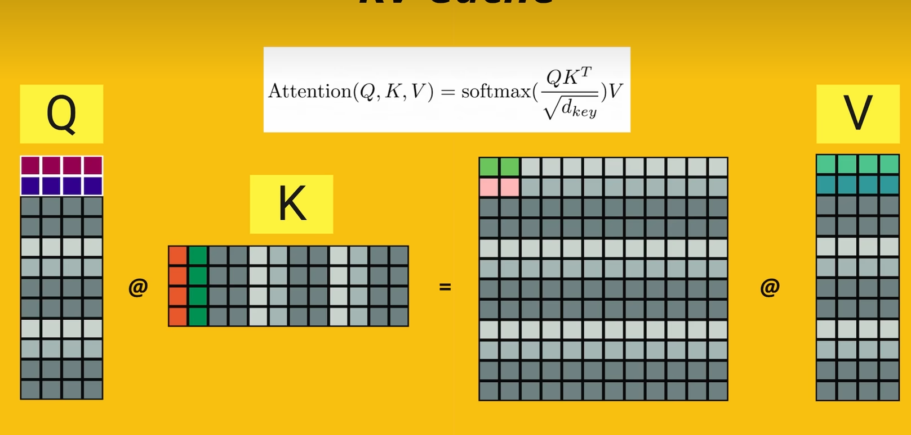
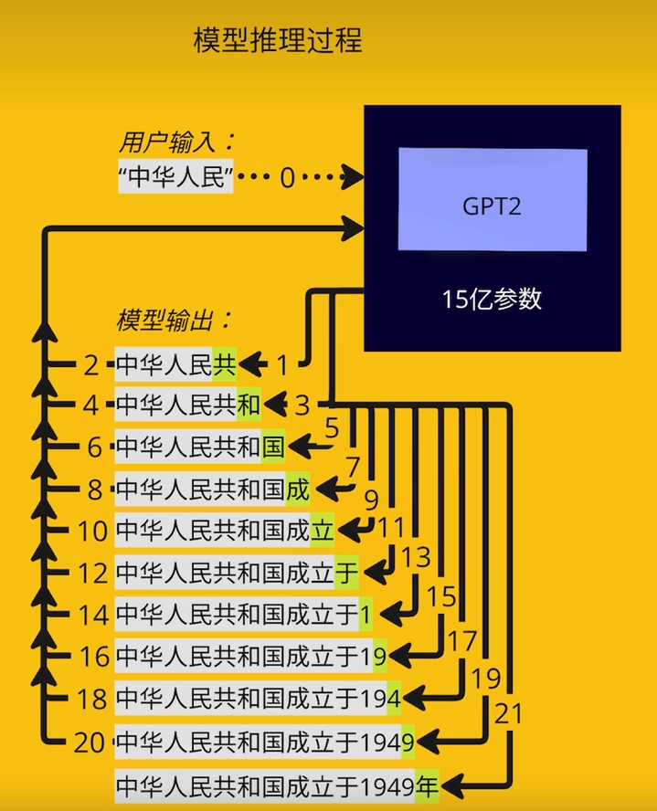
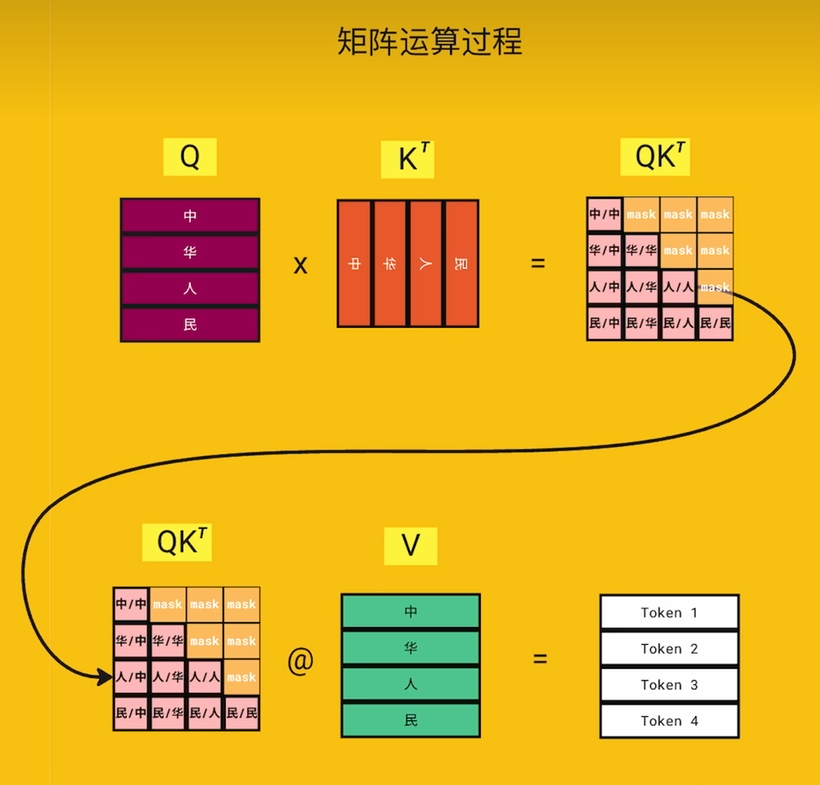
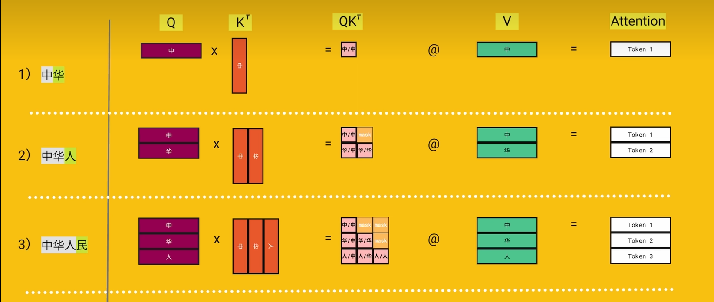
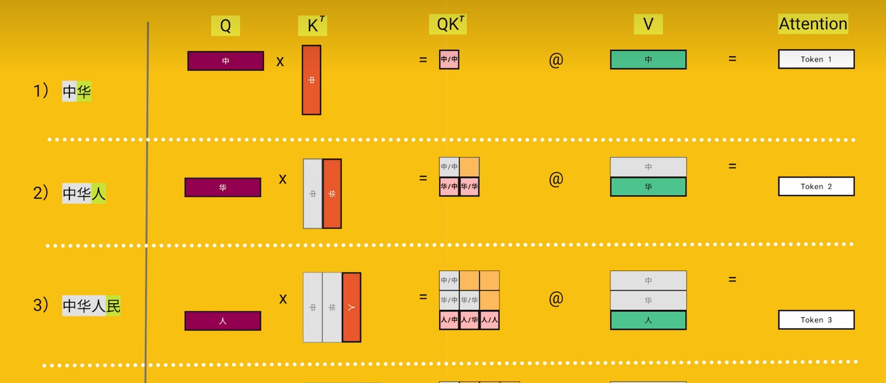

# KVcache 学习

**KVcache，是在推理场景中，利用因果注意力计算的掩码特性，加速因果注意力层计算的一种技术**

**图片来源：**B站视频：https://www.bilibili.com/video/BV17CPkeEEzk?vd_source=e59646cb2312d9899577dc62a7676cc5

## 提出背景

**解码器注意力计算：**

**模型自回归过程：**

**由于因果注意力层的掩码机制，对于每个token，只需要计算其对自己，和其之前生成token的注意力。**、

**所以我们其实每次回归（生成token），只需要对新生成的token计算注意力即可**

**因果注意力计算过程：**

## 具体做法

**不使用KVcache的自回归过程：**

**使用KVcache的自回归过程：**

**我们的本质目的：**在因果注意力层输出新token（比如输入“中华人民”，我们只需要生成token3，因为token1和token2是不变的）

**计算所需要存储的数据：**之前的K，V

**KVcache的机理：**

输入新生成的token，生成它的Q，K，V向量，并将K和V向量并入之前的K,V矩阵。

由Q向量左乘K矩阵，生成新的QK向量

用新的QK向量左乘V矩阵，生成新AttensionOutput,将其输出

（推理模式：自回归过程，生成的AttensionOutput只需要包含新token的AttensionOutput）

## KVcache的优缺点

**优点：**大大加速了推理过程

**缺点：**大大增大了內存占用（上下文窗口越大，要存储的K和V就越多）