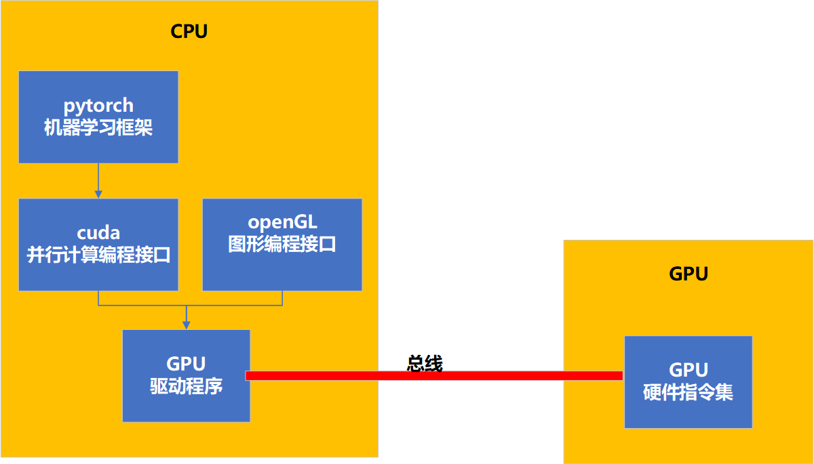

# GPU硬件结构

## CPU与GPU的交互



## GPU硬件层级


**1. GPU面向SM，以线程块作为调度单位**

**2. SM面向想cuda核，以扭曲（wrap：多个线程）作为调度单位**


## 一次张量运算的硬件处理过程

```python
#cpu创建张量（此时张量位置：cpu內存）
M, K, N = 1024, 512, 1024
A_cpu = torch.randn(M, K)  # 1024x512
B_cpu = torch.randn(K, N)  # 512x1024

#移动张量到GPU（此时张量位置：gpu的hbm）
A_gpu = A_cpu.to(device)        #A_gpu:gpu张量在cpu中的句柄
B_gpu = B_cpu.to(device)

#执行矩阵乘法（此时张量位置：gpu的某个SM）
C_gpu = torch.matmul(A_gpu, B_gpu)

#将结果移回CPU（此时张量位置：cpu內存）
C_cpu = C_gpu.to("cpu")
```

**pytorch运行大模型是一个典型的异构计算场景：**

**（1）CPU先将数据传到GPU，保留句柄。**

**（2）通过操作句柄，指挥GPU运算**

**（3）最后GPU将结果返回给CPU（如果是图形渲染可能就通过总线直接渲染到屏幕了）**

