# 大模型量化入门

##  大模型量化的本质

​	将**浮点型**的参数和输入值，转为**整型**。从而降低模型推理的**內存占用**，提高**推理速度**，**降低通讯量**也能降低模型的**存储大小**

​	$WX=  ((\lfloor\dfrac{W}{scale_w}\rfloor) * scale_w) \times (\lfloor\dfrac{X}{scale_x}\rfloor) * scale_x) = W_q X_q* scale_w * scale_x $

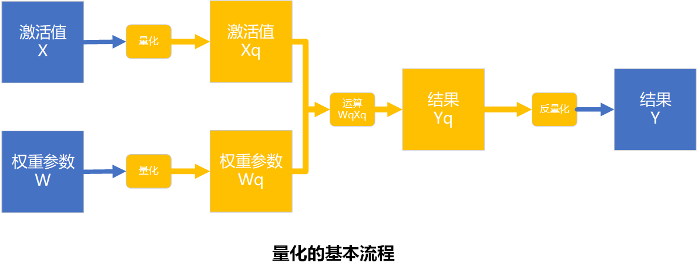

## 大模型量化研究要解决的主要问题

让量化反量化后的运算结果，尽量接近原来的运算结果

$W_q X_q *scale_w*scale_x$   ------>   $WX$

## 大模型量化中的各种基本概念

- **量化**:将**模型参数**和**输入值**从浮点数范围，通过**缩放因子**和**零点**，转到整数范围。

- **反量化**:将模型推理得到的结果，从整数范围，转换回浮点数范围。

- **量化感知训练**:在模型训练时引用量化反量化运算，是模型调整参数以适应量化。
- **训练后量化**:对一个已经训练好的模型采用量化

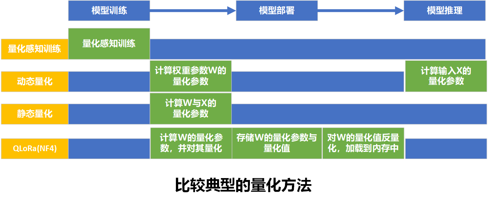

PS**:动态量化**、**静态量化**和**NF4**都属于**训练后量化**。

## 训练后量化

对一个已经训练好的模型进行量化，典型方法有**动态量化**、**静态量化**和**NF4**。

### 基本量化算法

#### 对称量化（Int8量化为例子）

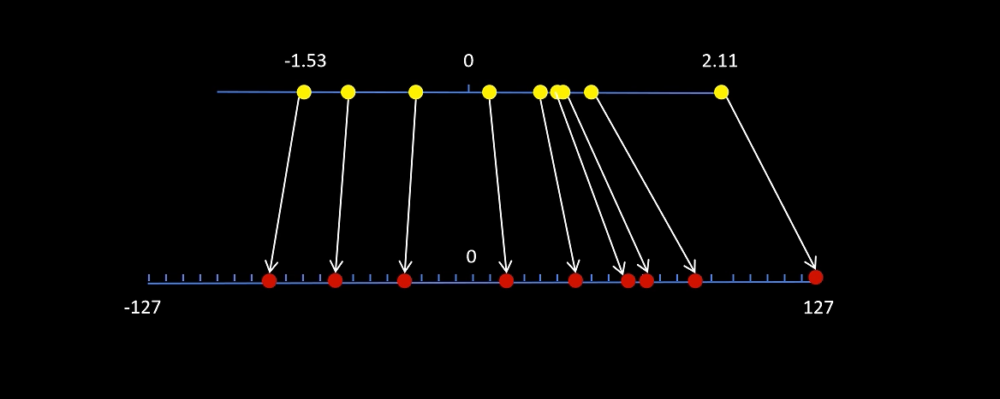

**解释**:选取W中绝对值最大的权重参数，以其**绝对值与127**的商作为scale（scale 为量化参数）

$scale = \dfrac{max(|W_{ij}|)}{127}$

$W_q =clamp( \lfloor\dfrac{W}{scale}\rfloor,-2^n+1,2^n-1$​ ）

$clamp(x,a,b) = \begin{cases} x, & a<=x<=b \\ a, & x<a \\ b, & x>b \end{cases}$

**优点**:计算简单

**缺点**:不能充分利用整数空间（图中-127附近那段空间没有利用到），精度损失较大

#### 非对称量化

​	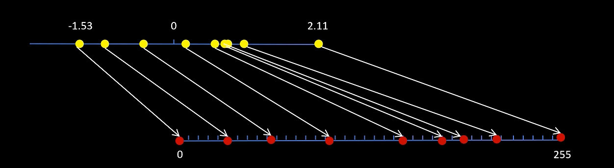

**解释**:将W中最小值映射到0，最大值映射到255（scale和zero_point为量化参数）

$scale = \dfrac{max(W_{ij})-min(W_{ij})}{255}$​

$zero\_point = \lfloor\dfrac{|min(W_{ij})|}{scale}\rfloor$

$W_q = clamp(\dfrac{W}{scale}+zero\_point,0,2^n-1)$

**优点**:精度损失更小

**缺点**:量化和反量化的过程比较复杂

### 具体量化策略

#### 动态量化

**解释：部署**前**，确定权重参数**的**量化参数**；**推理**时，**动态计算激活值**的**量化参数**。

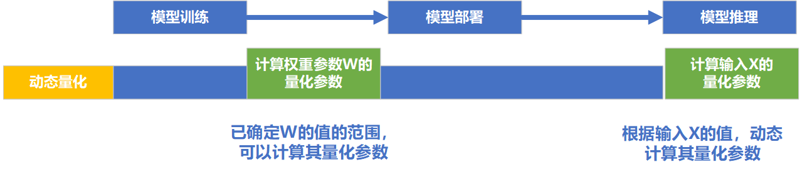

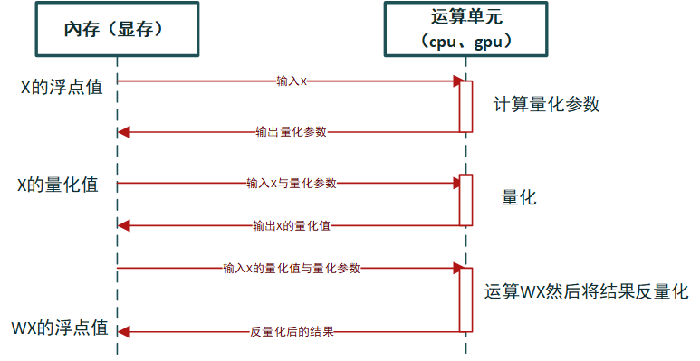

**优点**：根据实际的X，计算最优的量化参数，**精度损失小**

**缺点**:每次都要**重新计算X的量化参**数，并将反量化后的结果存到显存中。**通讯量**和**显存占用大**，**推理速度慢**。

#### 静态量化

**解释：训练完成后**或者**训练过程**中，统计X的大致分布范围，提前计算好一个**近似的X的量化参数**

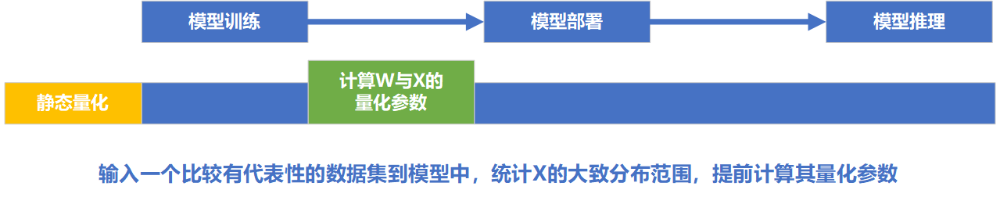

**缺点**:X的量化参数通过训练时的校准数据，统计得出，非推理时输入X的最佳量化参数，精度损失较大

**优点**:推理过程中无需在內存中**存储浮点精度的X**，同时减少內存与GPU通讯量（传递的是量化值）。**提高推理速度，降低显存占用。**

### 特殊量化算法（QLoRa非线性量化）

**解释**:权重矩阵中的值并不是线性分布的，很多时候多近似正态分布。给那些出现**更加密集的点**，分配**更多的整数空间**，可以**降低精度损失**。

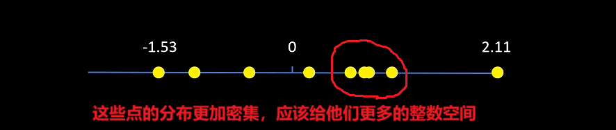

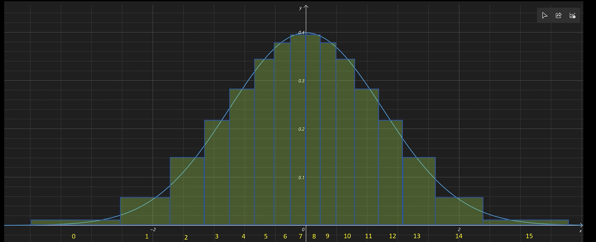

**具体计算过程**:(scale 为量化参数)

$scale = max(|X_{ij}|)$

**归一化**:$X\prime = \dfrac{X}{scale}$

**查表**:（0是比较特殊的值，我们给其独立分配一个空间，不然其向左向右偏都有问题）

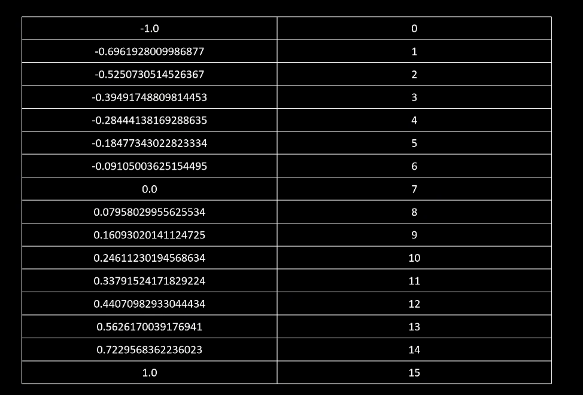

**优点**:更加充分地利用整数空间，更大程度低地**减少精度损失**。

**缺点**:属于**非线性量化**，量化得到的量化值**不能直接参与运算**，必须**反量化回浮点值**再运算

**总结**:只能算一种显存和磁盘存储优化方案，只使用这种方法，反而会降低推理速度。

## 量化感知训练

**解释**:在模型训练过程中引入量化和反量化的运算，以让模型能够适应量化。

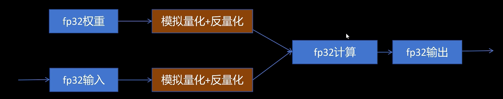

**优点**:较大程度上提高模型的性能

**缺点**:需要对一个模型再训练，成本较高

****
