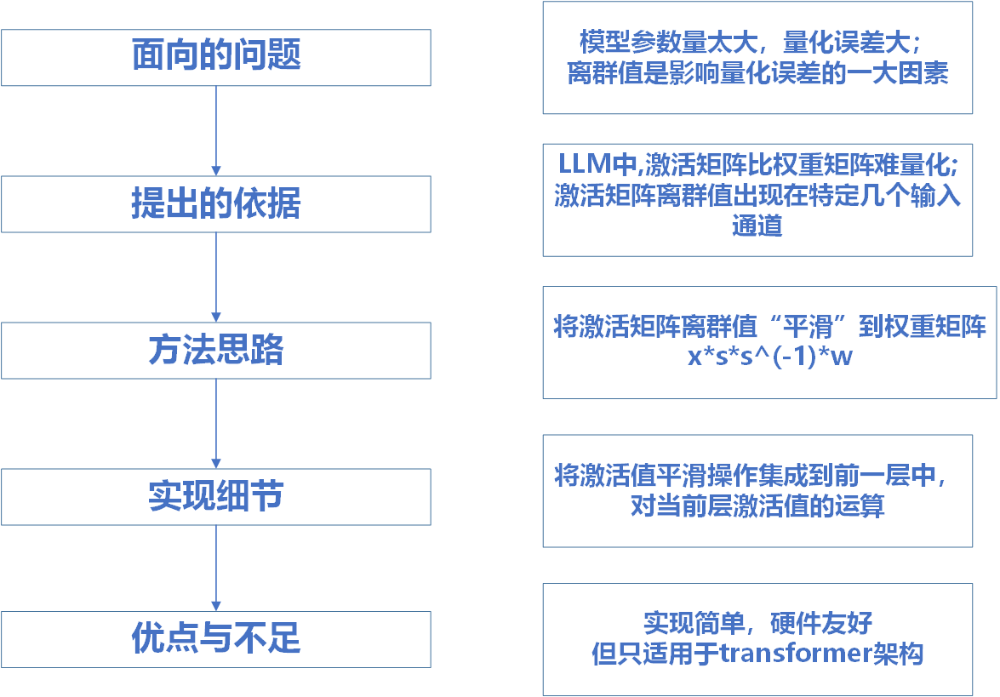
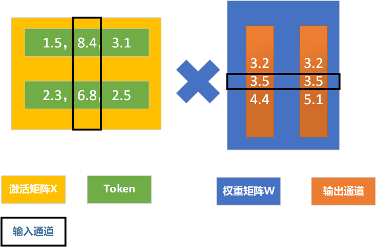
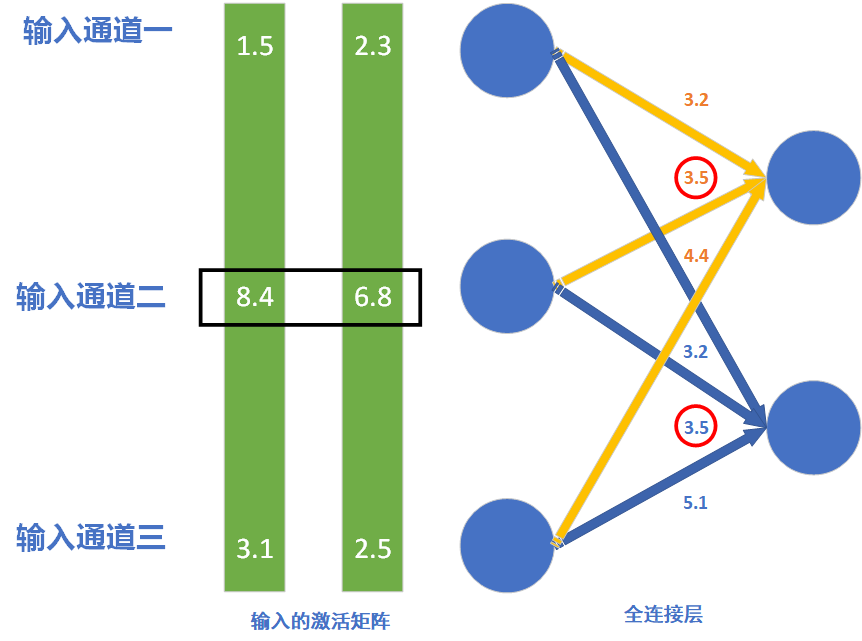
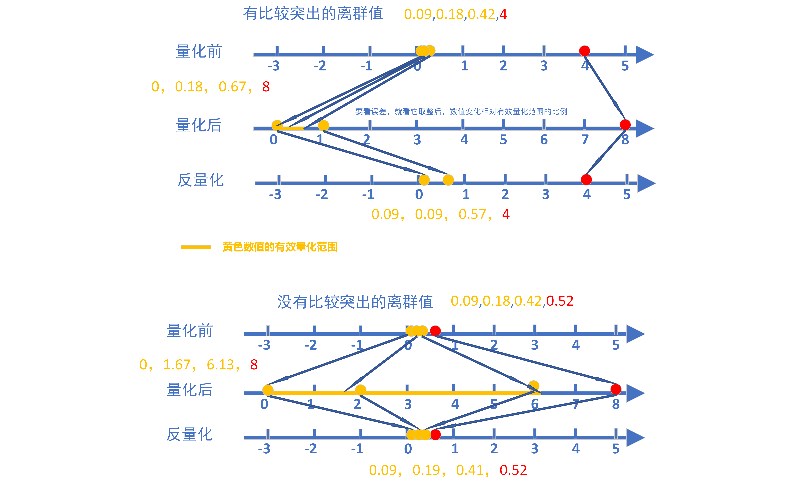
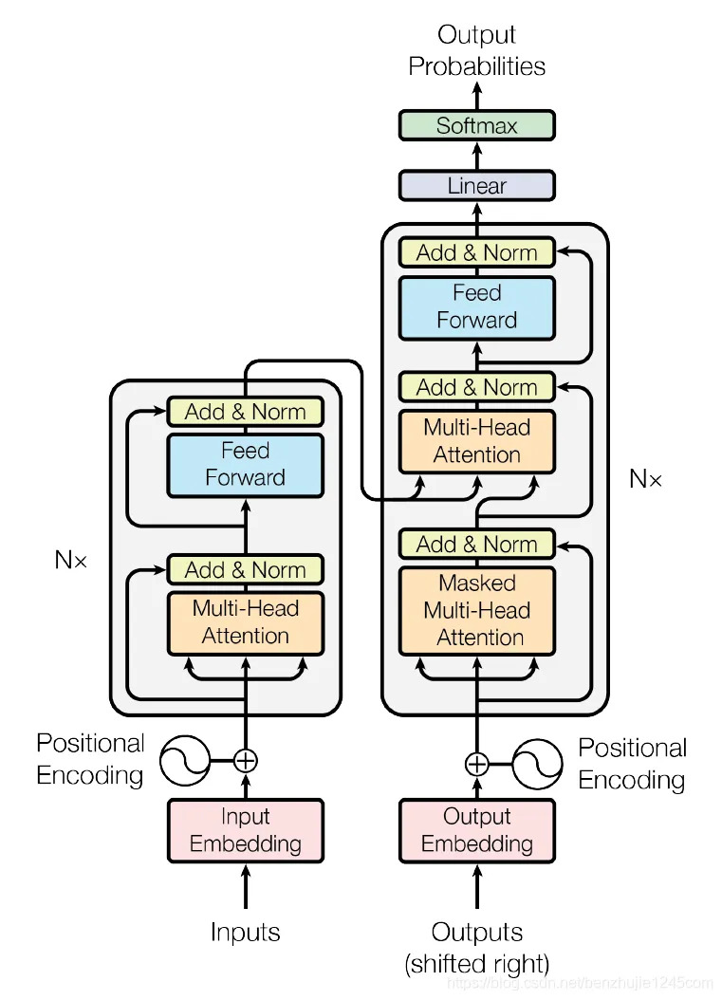
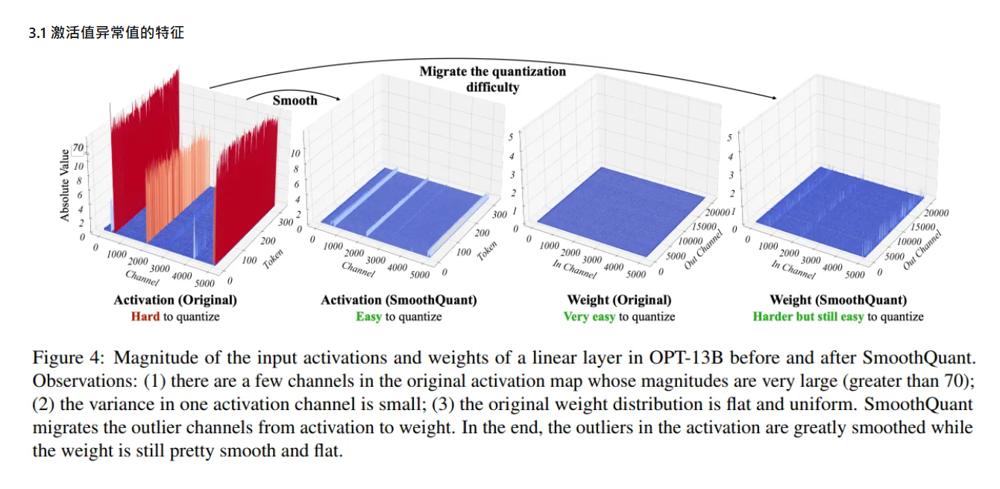
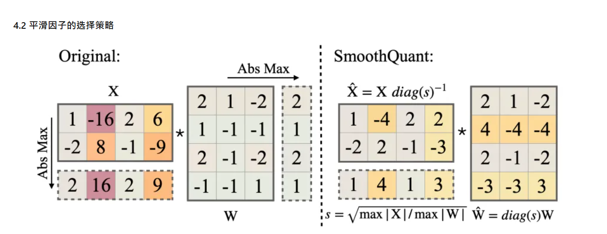

# smoothQuant (将量化难度从激活值迁移到权重)

**参考论文：**SmoothQuant: Accurate and Efficient Post-Training Quantization for Large Language Models

**Arxiv编号：**2211.10438

## 简介

**smoothQuant是一种通过将激活值的量化难度，迁移到权重矩阵上的，LLM量化方法**

**解决的是激活矩阵中离群值，造成较大量化误差的问题**

- **大纲**

## 概念说明

### 输入通道

**先知道有这么一回事**

### 有效量化级别

**输入通道的有效量化级别（真正使用到的整数的个数）**：

$m = max_{ij}(|X_{ij|})$

$L_{(j)} = 2^8 \dfrac{max_i(|X_{ij}|)}{m}$

**ps:** 输入**通道j的绝对值最大值**越接近**整个激活矩阵的绝对值最大值**，其有效量化级别越大

## 面向的问题

### 当模型的参数量大于一定程度时，量化误差会急剧增大，模型性能急剧下降

#### 图示说明 

**FP16:**浮点运算

**LLM.int8:**单独让**离群值保持原精度运算**的量化技术

**W8A8:**最普通的量化，就是**直接**进行**对称量化**和**非对称量化**

**ZeroQuant:**对**权重矩阵分组量化**，对**激活矩阵逐token量化**

**SmoothQuant:**将激活矩阵的**量化难度转移到权重矩阵**上再量化

#### 原因剖析

有论文研究过这个问题，我们以后再去研究

###  离群值是造成量化误差的一大因素

#### 计算示例说明（有较大的离群值）

W中有**离群值**

- $W = (0.12,0.52,0.42,1.25,\textcolor{red}{6.7},0.69)$​

- **计算量化参数** $scale = \dfrac{6.7-0.12}{255} = 0.0258$  ，	$zero\_point = \dfrac{0.12}{scale} = 4.65$

- **量化**   $W_q = round( \dfrac{W}{scale}-zero\_point )= (0,15,11,43,255,22)$

- **反量化** $W\prime = (W_q+zero\_point)*scale = (0.12,0.50,0.40,1.22,6.7,0.68)$

- **结果分析**

初始值：        $W  = (0.12,\textcolor{red}{0.52},\textcolor{red}{0.42},\textcolor{red}{1.25},6.7,\textcolor{red}{0.69})$
反量化后值：$W\prime = (0.12,\textcolor{red}{0.50},\textcolor{red}{0.40},\textcolor{red}{1.22},6.7,\textcolor{red}{0.68})$​

**初始值与反量化值均方误差**：0.000142

#### 计算示例说明（没有离群值）

$W = (0.12,0.52,0.42,1.25,\textcolor{red}{6.7},0.69)$

$A = (0.12,0.52,0.42,1.25,\textcolor{red}{1.25},0.69)$

$scale = \dfrac{1.25-0.12}{255} = 0.00443$

$zero\_point = \dfrac{0.12}{scale} = 27.08$

$A_q = round( \dfrac{A}{scale}-zero\_point ) (0,90,67,255,255,128)$

$A\prime = (A_q+zero\_point)*scale = (0.12,0.51,0.41,1.25,1.25,0.68)$​

$A = (0.12,\textcolor{red}{0.52},\textcolor{red}{0.42},1.25,1.25,\textcolor{red}{0.69})$

$A\prime = (0.12,\textcolor{red}{0.51},\textcolor{red}{0.41},1.25,1.25,\textcolor{red}{0.68})$

**A初始值与反量化值均方误差**：0.000003

**W初始值与反量化值均方误差**：0.000142

#### 图示说明

如果**直接量化**，会导致非离群值所**映射到的范围过小**，即其**有效量化范围较小**，造成较大量化误差。（**非离群值映射到的范围较小**）

**为什么呢？能不能形式化地展示呢？**

- $x$ 为原始值

- $a = \dfrac{x}{scale} - zero\_point$ 

- $a \prime = round(a)$​

- $x\prime = (a\prime+zero\_point)*scale$

- $x-x\prime = x-(round(\dfrac{x}{sacle}-zero\_point)+zero\_point)*sacle$

	$ = scale*(\dfrac{x}{scale}-zero\_point - (round(\dfrac{x}{scale})-zero\_point))  $

	$ = scale * (a-a\prime)$

- **x初始值和反量化值的最大相对误差**

- $max(x_r) = \dfrac{scale * max(|a-a\prime|)}{|x|} = 0.5 * \dfrac{scale}{|x|}$

## 提出的依据

**激活矩阵中**

- **整个激活矩形的方差很大**
- **每个token自己内部的方差也很大**
- **每个token的离群值主要分布在特定的几个输入通道**

**权重矩阵中**

- **整个权重矩阵，相对激活矩阵方差较小**

所以我们在想，能不能把激活矩阵的离群值和权重矩阵的权重值**中和**一下，降低激活矩阵的量化难度

## 方法思路

### 核心思路

让**离群值变小一点**，与之相乘的输入通道的**权重参数变大一点**

**对于同一个输入通道的运算**：比如第i个输入通道，涉及运算的激活值和权重参数，在**X的第i列**，**W的第i行**

**输入通道i的平滑因子**$diag(s_i) = \sqrt{\dfrac{max_k(|X_{ki}|)}{max_p(|W_{ip}|)}}$

**运算转换**：$x*w = x*diag(s)^{-1}*diag(s)*w = x\prime * w\prime$

### 获得一个“好”的平滑因子

- 引入超参数 $\alpha$, 表示将多少难度从激活矩阵迁移到权重矩阵

$diag(s_i) = \dfrac{max_k(|X_{ik}|)^{\alpha}}{max_p(|W_{pi}|)^{1-\alpha}}$

- $\alpha$一般选0.4到0.6，具体怎么找用**快速网格搜索**（一种快速找合适超参数的算法）

## 实现细节

- 权重平滑$diag(s)*w$ 实现很简单，直接修改权重矩阵的值即可
- 关键是如何引入激活值平滑 $x*diag(s)^{-1}$

### X由一个线性操作得到，直接将运算集成到前一个W

比如对第i个输入通道平滑，直接将前一个运算的权重矩阵的第i列除以平滑因子即可

比如：

$X=WX\prime$

$\dfrac{X}{a} = \dfrac{W}{a} X\prime$

### X由一个激活函数得到

X由一个激活函数得到的，理论上是不能直接将平滑因子融合到前一层的。

**比如**:

$activate(X\prime W) = X$

$activa(X\prime W/a) \neq X/a$

**但是如果激活函数是ReLU函数就会得到：**

$ReLU(X\prime W/a) = ReLU(X\prime W)/a =  X/a$

**这是由ReLU的正齐次性得到的：（a>0）**

$ReLU(kx) = k*ReLU(x), k>=0$

### X由一个残差连接获得

$X = WX_{pre} + B$

$X\prime = W\prime X_{pre} + B * diag(s)^{-1}$

对残差分支我们要引入额外的运算

## 优点与不足

**优点**

- 毋庸置疑，大大减小了量化误差
- 实现简单
- 相比LLM.int(),对硬件更加友好，可以启动推理加速（LLM.int()需要对离群值单独原精度计算，计算更复杂）
- 可以和其它量化方法一起用

**缺点：**

- 只适用于transformer架构
- 当模型的参数量再大点时，出现了更大的离群值时，smoothQuant也无能为力，因为W的量化难度也变大了
