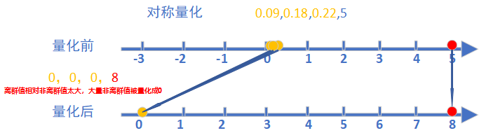
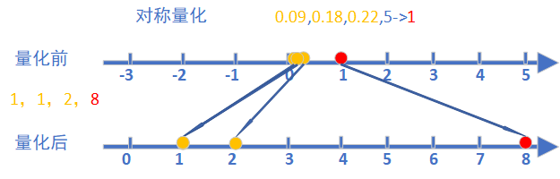
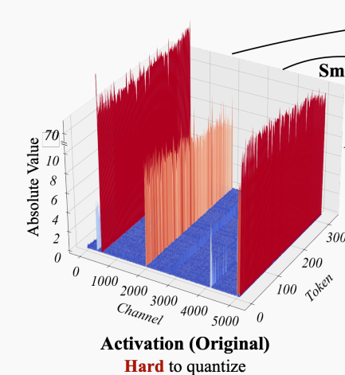
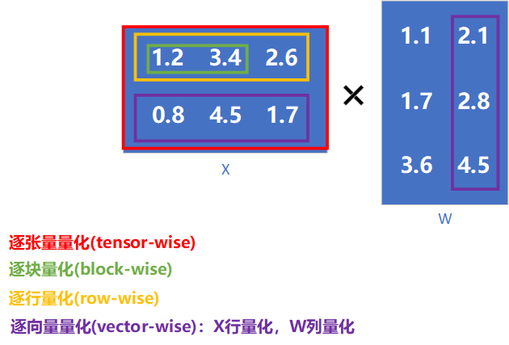
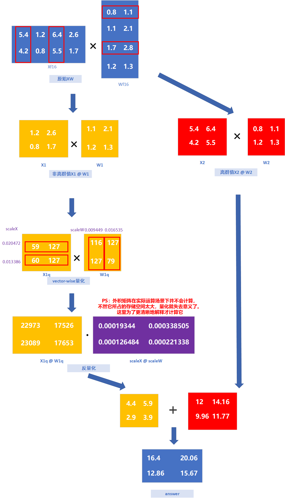
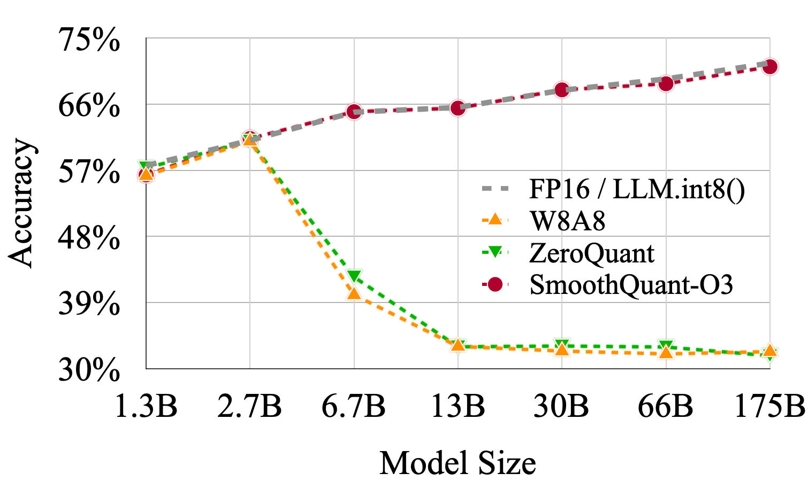
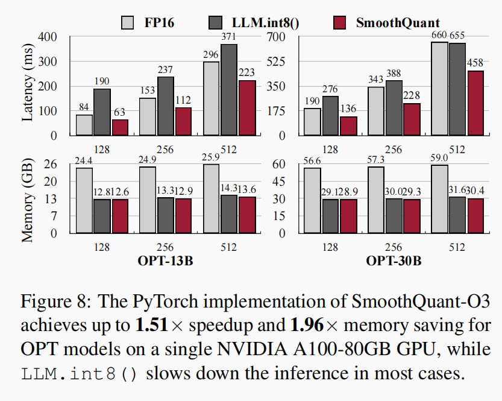
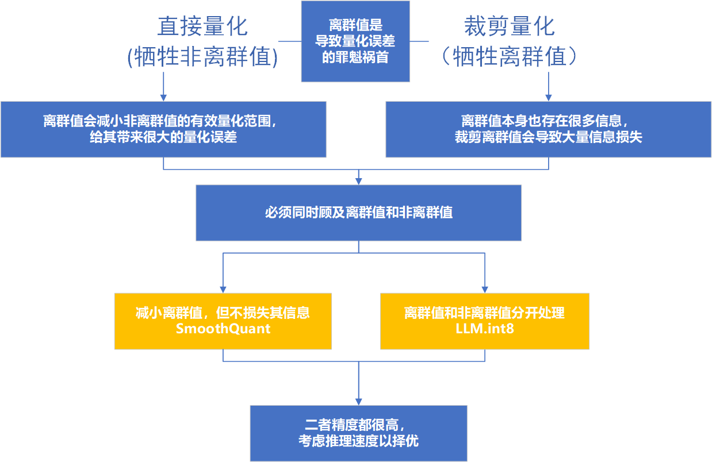

# LMM.int8量化方法(混合精度量化)

**参考论文：**LLM.int8()**: 8-bit Matrix Multiplication for Transformers at Scale**

**Arxiv编号：**2208.07339

## 简介

**LMM.int8**是一种针对**自注意力回归(transformer的解码器)模型**的，通过**对离群值和非离群值分别运算**的，

用于降低量化误差的**量化方法**。

## LLM.int8提出背景

### 离群值是导致量化误差的"罪魁祸首"

**离群值**会**“拉大"量化的范围，**从而降低非离群值的**有效量化级别**，造成**非离群值信息丢失**，造成**量化误差**
$scale = max_{ij}(|X_{ij}|)$

$x \prime = round(\dfrac{x}{scale})$

**当离群值很大时，scale很大，很多非离群值被量化成了0，造成大量的信息丢失**

（详情请看1.2smoothQuant的笔记）

### 裁剪离群值的做法不可行（牺牲离群值保全非离群值）

- **裁剪离群值**

**既然离群值的存在，增大了非离群值的量化误差，有一种做法就是裁剪离群值**

**即设定一个阈值，超出这个阈值的激活值便截断**

$threshold = 1$

- **但论文中实验得出：**离群值对模型的性能至关重要，暴力裁剪会造成大量信息丢失，模型困惑度急剧上升
- **保护非离群值的正确做法是：smoothQuant（提高非离群值有效量化级别，且保全离群值信息）**
- **LLM.int8()提供了另外一种思路：**将离群值和非离群值分开计算

### 随着模型参数量增大，离群值的出现呈现出系统性

（详情请看1.2smoothQuant的笔记）

## LLM.int8具体做法

### 使用vector-wise量化

- **各种量化级别**

- **更细粒度的量化**可以减小**离群值对非离群值的影响**，减小**非离群值量化误差**（让x更接近scale）

**1.2smoothQuant笔记中计算最大量化误差的公式：**$max(x_r) = 0.5 * \dfrac{scale}{|x|}$

- **使用vector-wise(向量级量化)**：更加适配LLM.int8的混合精度量化策略(下面介绍)

### 混合精度量化(分别计算离群值和非离群值)

## 评价

**优点：**

- 从根本上解决**大参数量transformer架构模型**，量化后模型精度下降的问题

**缺点：**复杂的计算过程，导致其推理速度远不如smoothQuant

- **生成256个token的端到端时延和峰值內存占用**

## 总结

**smoothQuant和LLM.int8是解决大参数量transformer模型，量化后精度下降的两大经典方法。**

**AWQ和GPTQ是受这两种方法启发的更加先进的方法**

## 思考

- **zero_point量化(非对称量化)不是比absMax量化(对称量化)，精度保留效果更好吗，为什么不用？**

	zero_point量化和非输入通道量化一样，都是通过增大有效量化范围，来**缓解**离群值造成的非离群值的量化误差。**治标不治本**。

	zero_point的计算过程**比absMax复杂的多**。

	当模型参数量大到一定程度时，离群值的出现呈现出**系统性**和**对称性**

	已经不值得牺牲性能去换那点杯水车薪的精度提升了。

- **zero_point具体是比absMax慢多少呢?**

​	**对于absMax(仅需一次矩阵乘法)：**

​	$WX =  \dfrac{WX}{scale_wscale_x} = W\prime X\prime$ 

​	**对于zero_point（若GPU不提供核函数，多了很多额外计算）**

​	$WX = (\dfrac{W}{scale_w}+zp_w)(\dfrac{X}{scale_x}+zp_x) = \textcolor{red}{(W\prime+zp_w)(X\prime+zp_x)} = W\prime X\prime + Wzp_x + Xzp_w + zp_wzp_x$

- **为什么参数量增大，量化误差会增大呢？**

	原文中实验得出，参数量增大，导致离群值变得特别突出，所以量化误差就增大了(离群值是造成量化误差的关键)

