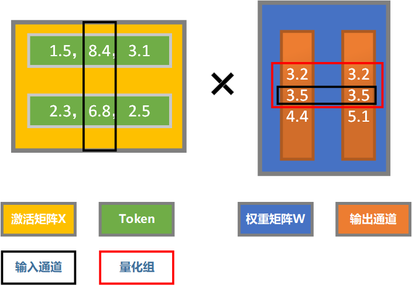
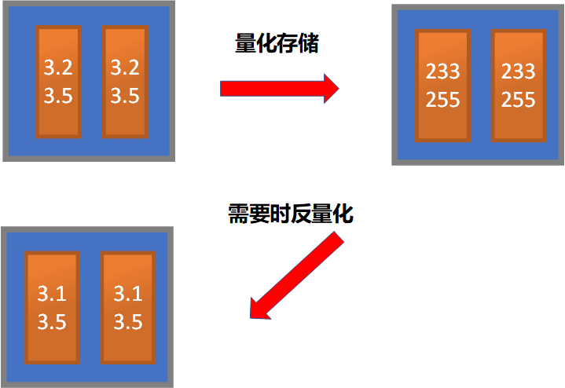
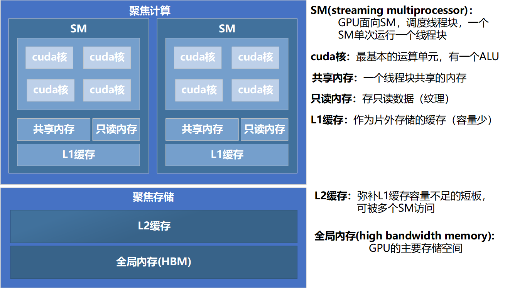
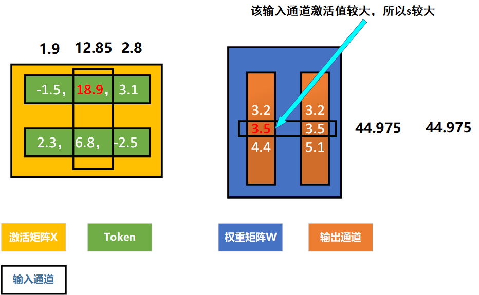

# AWQ:基于激活值感知的权重量化

**论文**：AWQ: ACTIVATION AWARE WEIGHT QUANTIZATION FOR ON-DEVICE LLM COMPRESSION AND ACCELERATION

**作者：**Ji Lin ，Jiaming Tang，Haotian Tang

**单位：**Mit-Han-Lab

**Arxiv编号：**2306.00978

**发表期刊：**Proceedings of Machine Learning and Systems 6 MLSys 2024

- 通过参与计算的激活值的大小，去识别权重矩阵中的重要通道，放大这些重要通道的数值，以在量化过程中保护它，从而降低量化误差。

- AWQ是一种针对权重值的量化方法，所以其参与矩阵运算的仍然是原精度的矩阵。其给模型带来的推理速度增益，主要是减小权重值从L2缓存到SM的通信量。

## 量化误差的衡量

**AWQ采用的是逐组量化，即将若干个输入通道分为一组进行量化**

**有效量化位数：**

$L_w = 2^n \dfrac{|w|}{max_i(|group_i|)}$

- $w$: 权重值
- $n$: 量化位数
- $max_i(group_i):$ 该组的绝对值的最大值

**例：**将图中红框标识的组量化到8位，求3.2的有效量化位数

$L = 2^8 \cdot \dfrac{3.2}{3.5} =  234.057 $

## AWQ量化

### W8A16量化

**AWQ是一种只对权重值的量化，即W4A16量化**

- **相当于只是对权重值进行量化存储，需要时再反量化使用**

### AWQ做法

**AWQ通过对重要权重值进行放大，提高其量化位数**

- **AWQ量化计算公式：** $X\cdot Q(W) = X \cdot \dfrac{1}{s} \cdot Q(W \cdot s)$​

**通过输入通道激活值平均模长的大小来选取s：**

$$
\large
\begin{array}{l} \\
s_{xi} = mean_j(|X_{ij}|) \\
s_i = s_{xi}^\alpha \\

\alpha \in [0,1] \\
\end{array}
$$
**如何选取超参数$\alpha$​**:

- **衡量量化误差：**

	

$$
\large
\begin{array}
\mathcal{L}(s) = \| Q(W \cdot \text{diag}(s))(\text{diag}(s)^{-1} \cdot X) - WX \|
\end{array}
$$

- **用采样的方法来选取$\alpha$**:

$$
\large
\begin{array}{l}
\alpha^* = \arg \min_{\alpha} \mathcal{L}(s_X^\alpha) \\
\alpha^* \in\{0,0.1,0.2,...,1\}

\end{array}
$$

## 评价

AWQ是一个比较成熟的方法，在很多平台都支持，并且经常和smoothQuant一起使用，实现W4A8量化

**优点：**

- 使用缩放的方法来保护重要通道的权重值，而不是混合精度量化，更有利于与SmoothQuant集成，实现量化值参与运算

