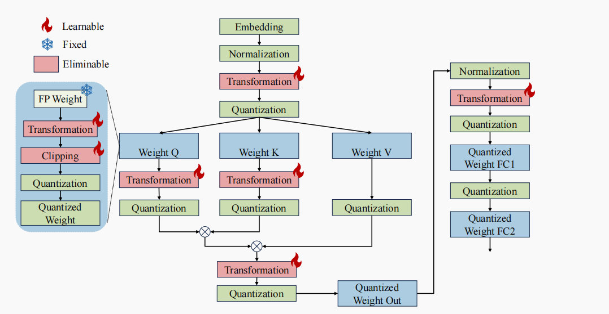

# 可学习量化算法参数——OmniQuant

在训练后量化和量化感知训练之间找到一个平衡点，不训练权重参数，而是训练几个引入的、会影响量化难度的参数


## 方法介绍

### LWC：learnable weight clipping

**学习权重阈值：**
$$
\large
\begin{array}{l}
\mathbf{W_q} = \text{clamp}(\lfloor \frac{\mathbf{W}}{h} \rceil + z, 0, 2^N - 1) \\ \\
h = \frac{\gamma \max(\mathbf{W}) - \beta \min(\mathbf{W})}{2^N - 1}\\ \\
\quad z = -\lfloor \frac{\beta \min(\mathbf{W})}{h} \rceil
\end{array}
$$


其实就是引入$\gamma$和$\beta$来控制非对称量化的上下限（保离群值还是非离群值）

**算子融合：**因为是对权重转变，可以直接融合进权重矩阵


### LET：learnable equivalent transformation

**线性层：**学习逐通道的缩放因子和平移因子
$$
\large
\begin{array}{l}
\mathbf{Y} = \mathbf{XW} + \mathbf{B} = \underbrace{[(\mathbf{X} - \delta) \oslash s]}_{\tilde{\mathbf{X}}} \cdot \underbrace{[s \odot \mathbf{W}]}_{\tilde{\mathbf{W}}} + \underbrace{[\mathbf{B} + \delta\mathbf{W}]}_{\tilde{\mathbf{B}}}
\end{array}
$$
学习缩放因子$s$和平移因子$\delta$

**算子融合：**$X$的缩放和平移可以融合进前一层，$\tilde{\mathbf{B}}$则融合进行偏置项


**QK运算：**对Q和K进行缩放
$$
\large
\begin{array}{l}
\mathbf{P} = \text{Softmax}(\mathbf{QK}^T) = \text{Softmax}(\underbrace{(\mathbf{Q} \oslash s_a)}_{\tilde{\mathbf{Q}}} \underbrace{(s_a \odot \mathbf{K}^T)}_{\tilde{\mathbf{K}}^T})
\end{array}
$$
学习缩放因子$s_a$

**算子融合：**可以融合进得到$QK$的$W_Q$和$W_K$中


### 非对称量化

OmniQuant对激活值采用**对称量化**，对权重值采用**非对称量化**

**PS：**激活值我们已经引入了平移因子，所以可以采用对称量化（已经在LET中使用了平移需求）


**算子融合：**
$$
\large
\begin{array}{l}

\mathbf{Y} &\approx (h_x h_w) \cdot [(\mathbf{X}_q - z_x)(\mathbf{W}_q - z_w)] \\ \\

&= (h_x h_w) \cdot [\underbrace{\mathbf{X}_q \mathbf{W}_q}_{\text{Term 1}} - \underbrace{\mathbf{X}_q z_w}_{\text{Term 2}} - \underbrace{z_x \mathbf{W}_q}_{\text{Term 3}} + \underbrace{z_x z_w}_{\text{Term 4}}]

\end{array}
$$
由于对$X$进行对称量化，所以$z_x=0$，所以结果为:
$$
\large
\begin{array}{l}
\text{Result} = \underbrace{\mathbf{X}_q \mathbf{W}_q}_{\text{核心 GEMM}} - \underbrace{\mathbf{X}_q z_w}_{\text{补偿项}}
\end{array}
$$
分开两项算，因为$z_w$是个向量，所以第二项比较快


**PS：**当对激活值和权重值同时进行量化时（量化值参与线性运算），运算时会从int8升级到int32（为了避免溢出），

所以不用担心一个对称量化一个非对称量化的问题（-128 - 127 ：0 - 255 ）


### 训练

**训练目标：**逐个解码器进行训练，最小化，梯度下降，最小化量化前后的输出误差
$$
\large
\begin{array}{l}
\arg \min_{\Theta_1, \Theta_2} ||\mathcal{F}(\mathbf{W}, \mathbf{X}) - \mathcal{F}(Q_w(\mathbf{W}; \Theta_1, \Theta_2), Q_a(\mathbf{X}, \Theta_2))||
\end{array}
$$


## 实现细节



**在前馈神经网络中，**第二个全连接层不进行transformation（缩放和平移）

- 经过第一个全连接层的激活函数后，特征图呈现出稀疏性（很多值接近0），transfomration梯度不稳定


**QK：**原文这里用的是量化值运算，但原文中有实验数据表明，transformation对“量化值运算”的性能提升不大。
而且softmax也是要用原精度运算的。

- 再者，为了保持MiniCache的层间相似性，我们决定KVcache原精度保留


**round函数：**本身是不可微的，我们设它的导数为1


## 官方代码研究

### 先尝试跑一下原来的代码

**tokenizer变成bool类型的问题：**

```python
# 原文中有类似的代码
self.tokenizer = AutoTokenizer.from_pretrained(args.model, use_fast=False,legacy=False)

#改成这样：删除调用use_fast参数
#transformers中use_fast默认为True，若找不到快速分词器就会去找慢速分词器（在模型文件中）
#若设成False，对于Llama3这种默认使用快速分词器的模型，就会因为慢速分词器而报错
self.tokenizer = AutoTokenizer.from_pretrained(args.model)
```


### 关闭qk那里的let变换

（1）在smooth_and_quant_temporary和smooth_and_quant_inplace中，注释掉qk的let部分

（2）在omniquant函数中，注释掉qkt_smooth_scale参数的注册


