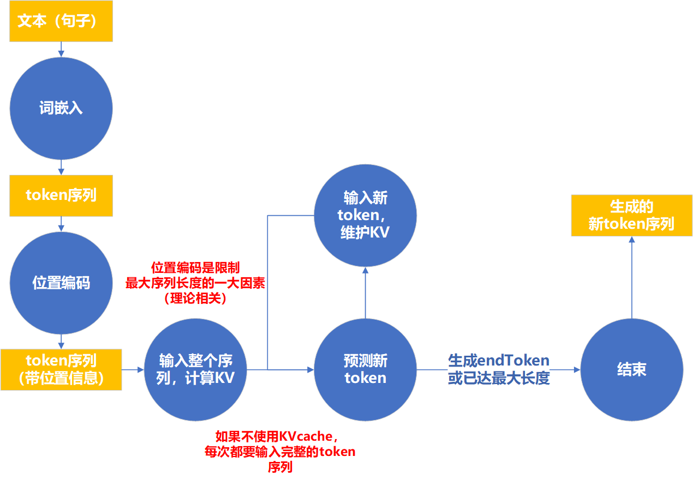

# transformer 输入输出

**为了研究KVcache的量化，我们首先要先明白一下KVcache的工作原理。**

**KVcache的抽象机理我们之前已经探讨过了，这次我们具体讨论一下KVcache的实现，及其硬件交互机理**

## 大模型的直接输入输出问题

**输出：**一个预测分数向量，用于预测下一个token是什么

**输入：**一个token序列，即一个矩阵

## 序列长度问题

- **在自回归过程中，除了第一次前向传播为了计算KV。之后的传播都是只输入新的token。**

- **决定输入序列最大长度的，不只是內存是否足以存储KVcache，还有位置编码的算法**

- **当生成序列超出上下文窗口长度时。**一般都是丢弃最早的内容（模型遗忘）

## 批次问题

**推理时：**

**大部分任务：**对话，文本生成都是批次为1的。

**少部分任务：**同时处理多个文本，可以使用多批次（很少用）

**训练时：**

一般都是多批次训练以提高训练效率。

