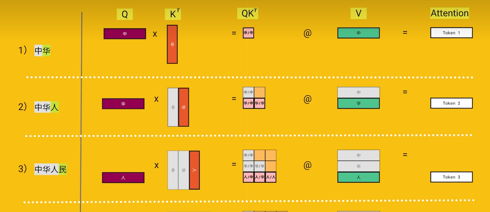
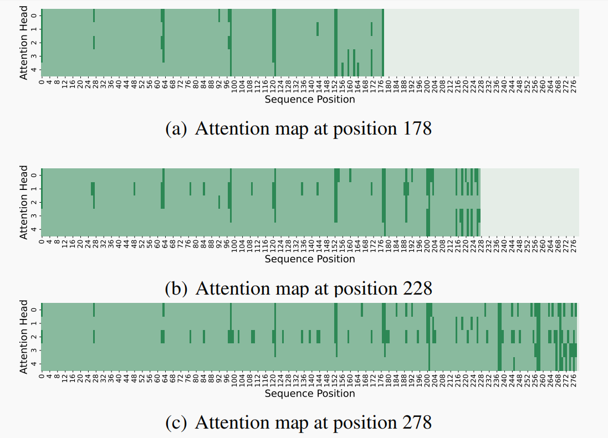
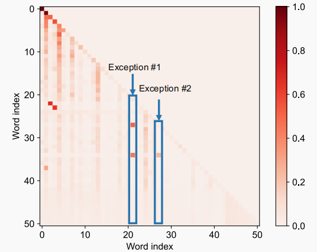
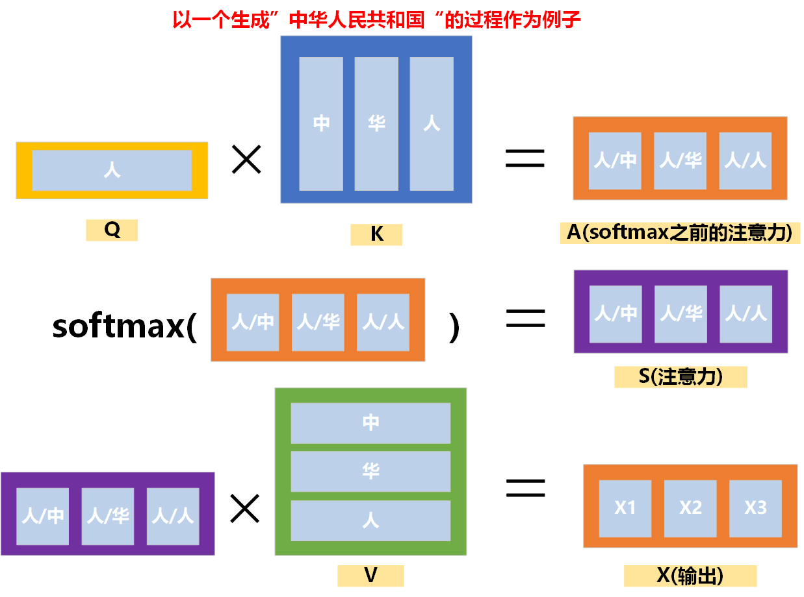
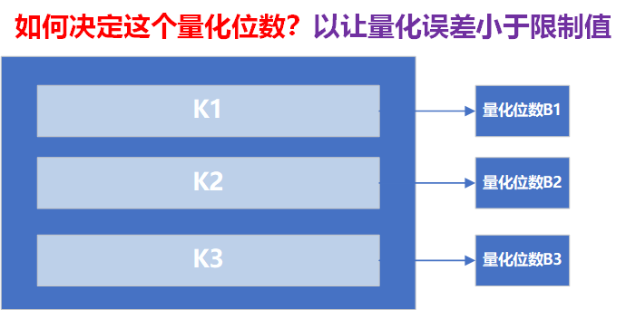
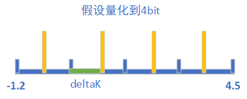
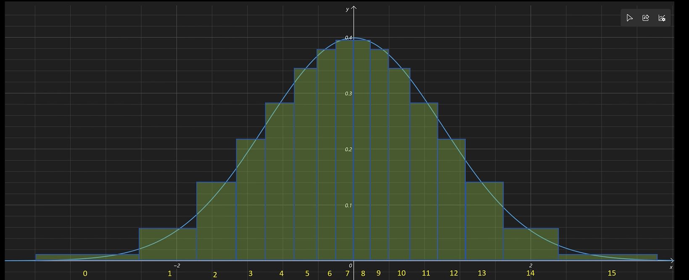
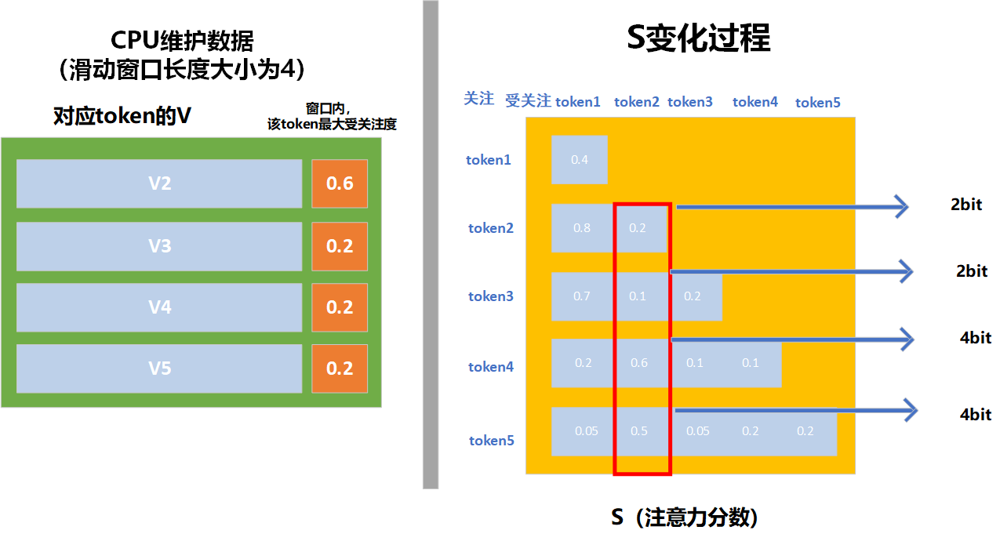
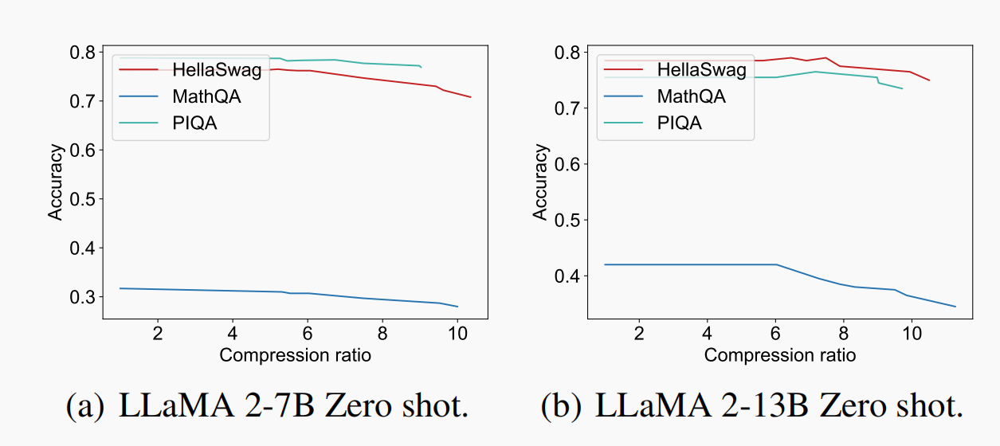
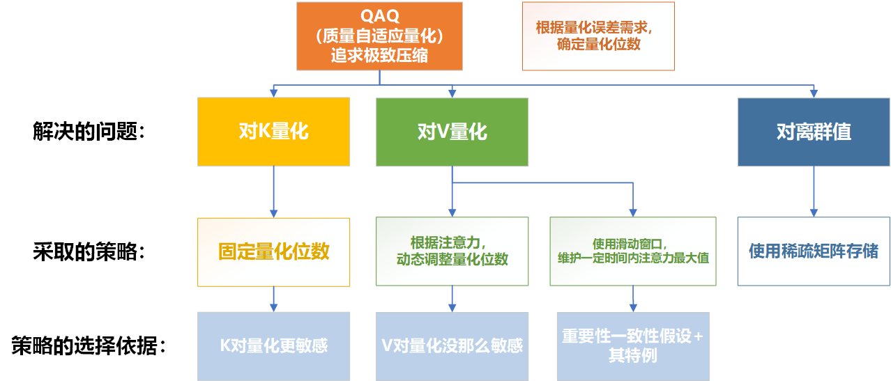

# KVcache优化-QAQ（**Quality Adaptive Quantization**）

 arXiv链接：[arXiv:2403.04643](https://arxiv.org/abs/2403.04643)

## 简介

**QAQ**是一种通过动态调整KV量化精度，极致压缩KVcache的方法

## 提出背景

### 面向的问题：**随着序列的增长，KVcache线性增大，占用很大的存储资源**

**KVcache大小计算公式：**

$size_{KVcache} = 2*N_{layer}*L_{token}*D_{layer}*size_{value}$​

$D_{layer}=N_{head}*D_{head}$

(隐藏层的维度其实就是头数，乘以头的维度)

**我们以LLaMa-2-7B作为例子：**

| **参数**             | **数值**            | **含义**               |
| -------------------- | ------------------- | ---------------------- |
| **层数 ($L$)**       | 32 层               | 模型的深度。           |
| **隐藏层维度 ($D$)** | 4096 维             | 模型的宽度。           |
| **参数量 ($P$)**     | 约 70 亿个参数 (7B) | 模型权重和偏置的总数。 |
| **精度**     | FP16 | 每个数值占两个字节 |
| **参数所占內存** | 2字节*70亿=14GB | 参数占用14GB的內存 |

**每个token的KV所占的內存**

$KV_{perToken} = 32*4096*2*2B = 0.5MB$ 

| **模型/上下文长度** | **权重内存占用** | **KV Cache最大内存占用**   |
| ------------------- | ---------------- | -------------------------- |
| **+ 8K 上下文**     | $\text{14 GB}$   | $8K * 0.5MB= \text{4 GB}$  |
| **+ 32K 上下文**    | $14 \text{ GB}$  | $32K*0.5MB= 16 \text{ GB}$ |

### 已有的研究成果

#### 稀疏矩阵（2019）

#### 多查询注意力（2023）

#### 重要性一致性假设（2023）

**Persistence of Importance Hypothesis：**

某个token是重要的token（被其它token重点关注，注意力分数大），仅当它过去是重要的token。

简单的说，就是某个token的重要性不会突然变大

178，228，278位置的token，重点关注的过去token大致相同。

**但是这个假设是有特例的：**即重要token，以前不一定是重要token

**QAQ采用了滑动窗口的方法来解决这个问题：**即维护某个token一段时间内受关注程度的最大值（重要性）

## 具体的做法

**目标：**在一定的**量化误差要求**下，极致地**压缩KVcache**

### 先做一些约定

**符号表示：**

- **S：**注意力分数向量
- **A：**没有经过softmax的注意力分数向量（$$QK^T$$）

- **X：**结果
- **Kq,Vq：**量化后的K和V（矩阵）
- **Aq，Sq，Xq：**使用量化的K和V计算得到的结果

- $\sigma_{t}(K),\sigma_{t}(V):$​​某个token的Kq向量和Vq向量的**定制化标准差（后面解释）**
- **当前的序列长度为T，词向量维度为D**

**假设：**

- **Kq和Vq是随机变量矩阵**
- **E(Kq)=K，E(Vq)=V**

- **对于同一个token的Kq和Vq向量内部的分量，它们同分布，且相互独立**

**解释定制化标准差：**

我们设一个随机向量X

$$\mathbf{X} = \begin{pmatrix} X_1 \\ X_2 \\ \vdots \\ X_n \end{pmatrix}$$​

$$\mathbf{D}(\mathbf{X}) = E[(\mathbf{X} - E[\mathbf{X}])(\mathbf{X} - E[\mathbf{X}])^T]$$

$$\mathbf{D}(\mathbf{X}) = \begin{pmatrix} \text{Cov}(X_1, X_1) & \text{Cov}(X_1, X_2) & \cdots & \text{Cov}(X_1, X_n) \\ \text{Cov}(X_2, X_1) & \text{Cov}(X_2, X_2) & \cdots & \text{Cov}(X_2, X_n) \\ \vdots & \vdots & \ddots & \vdots \\ \text{Cov}(X_n, X_1) & \text{Cov}(X_n, X_2) & \cdots & \text{Cov}(X_n, X_n) \end{pmatrix}$$

$$\mathbf{D}(\mathbf{X}) = \begin{pmatrix} \text{D}(X_1) & 0 & \cdots & 0 \\ 0 & \text{D}(X_2) & \cdots & 0 \\ \vdots & \vdots & \ddots & \vdots \\ 0 & 0 & \cdots & \text{D}(X_n) \end{pmatrix}$$

**分量之间相互独立：**D(X)是个对角矩阵

**分量同分布：**$D(X_1)=D(X_2)=....=D(X_n)$

**用统一值表示：**$$\sigma_{t}^2(X) $$​​表示D(X)的对角值

**对于Kq和Vq是同理的：**用$$\sigma_t^2(K)$$来表示第t个token的D(Kq)

**图示：**

### K和V对量化敏感度

$X_j = \sum_{t=1}^T S_t * V_{tj}$

$$\frac{\partial X_{j}}{\partial V_{ti}} = \begin{cases} S_{t}, & \text{if } i = j \\ 0, & \text{if } i \ne j \end{cases}$$

$$\dfrac{\partial X_{j}}{\partial K_{ti}} = S_{t} Q_{i} (V_{tj}-X_j)$$

**K比V对量化更敏感**

### 如何表示量化误差要求？

#### 做法

**给Xq，Sq的标准差设置一个上限值：**

- $$\sigma_{d}(X) < = $$$$\sigma_{max}(X)$$	d：表示X的第d个维度（词向量的第d个维度）

- $\sigma_{t}(S)<=$$\sigma_{max}(S)$	t：表示t的第t个维度（当前token对第t个token的关注度）

#### 原因

**以X来作为例子：**

$error_X$**正相关于**$D(error_X):$

- $error_X = Xq-X$

- $D(error_X)=E[((Xq-X)-E(Xq-X))^2]=E[(Xq-E(Xq))^2]=E[(Xq-X)^2]=E(error_X^2)$

$D(error_X)=\sigma(X) $：

- $D(Xq)=E[(Xq-E(Xq))^2]=E[(Xq-X)^2]=E(error_X^2)=D(error_X)$

**总之：$\sigma_t(X)$正相关于X的误差**

### 确定每个token对应的K和V的量化位数

**一句话：**给定Xq和Sq的**标准差上限**$\sigma_{max}(X)$和$\sigma_{max}(S)$,

找到每个token对应的，K向量和V向量可容忍的**最大量化位数**$B_t(K),B_t(V)$

#### 求V的标准差上限

$Xq_d = \sum_{t=1}^T S_t * Vq_{td}$	

$\sigma_d^2(X) = \sum_{t=1}^TS_t^2 * \sigma_t^2(V)$​ 

假设每个token对$\sigma_d^2(X)$的贡献相同（即$S_t^2 * \sigma_t^2(V)$相同）

$\sigma_d^2(X) = T * S_t^2 * \sigma_t^2(V)$ 

$\sigma_d(X) <= \sigma_{max}(X)$

得：

$\sigma_t(V)<=\dfrac{1}{\sqrt{T}} . \dfrac{\sigma_{max}(X)}{|S_t|}$

#### 求K的标准差上限

$Sq_t = \dfrac{e^{Aq_t}}{\sum_{i=1}^T e^{Aq_i}}$

$Aq_t = \sum_d^D Q_d.Kq_{td}$

**推导过程很复杂，这里就只展示最终结果：**

$\sigma_t(K) <= \dfrac{1}{\sum_{d=1}^DQ_d^2}.log(\dfrac{T^3}{T-1}.\sigma_{max}{S}-1)$

**最终的做法是，采用一个校准数据集，分析Q的平方范数的分布，取上10百分位数**

**上面的S也是动态计算的，为什么就对Q进行预计算呢？**

- Q的**变化比S频繁**，故V的标准差上限变化更频繁，其最大量化位数变化也更频繁。对其**动态计算消耗计算资源大。**

- 上面我们知道K对量化的敏感度是比V要大的，所以对其进行保守量化是合理的。

#### 通过标准差上限得到最大量化位数

以K为例：

假设我们要量化成$B_t(K)位$

$error_K = (Kq-K) \in [-\Delta K, \Delta K ]$

$\Delta K = \dfrac{step}{2}$

$step = \dfrac{K_{max}-K_{min}}{2^{B_t(K)}}$​

$2\Delta K · 2^{B_t(K)} = K_{max} -K_{min}$​

$error_K$符合均匀分布，所以 $\sigma_t(K) = \dfrac{\Delta K}{\sqrt{3}}$

$$B_t(K) = \lceil log_2(\dfrac{K_{t}^{\max} - K_{t}^{\min}}{2 \sqrt{3} \cdot \sigma_{t}^{(K)}}) \rceil $$

### 处理离群值

#### 定义离群值

**设置超参数$\alpha$:**超出上百分$\alpha$和超出下百分$\alpha$的作为离群值

**具体的界限：**通过校准数据预计算

#### 处理离群值

**用一个稀疏矩阵来存储离群值**（具体怎么实现不是很清楚，还没看代码，先理解大概思路）

## 集成

### 对于K

一开始就能够预计算其量化位数，量化位数始终固定。

### 对于V

根据新的**S**，即**新生成token对旧token的注意力分数**，来动态调整每个token对应的V的**量化位数**

**但是**由于量化造成的精度损失是不可能逆的，为了解决某个**token重要性突然变得很大**的问题，引入**滑动窗口**

## 评价

**优点：**极致地压缩了KVcache；且保持了相当的性能

**缺点：**策略复杂，且不能用量化后的KV直接参与运算

**QAQ一般是用于边缘场景的，因为它牺牲了一定的推理速度，来换取对KVcache的极致压缩，适应上下文窗口需求**

**（原文中没有推理速度下降多少的数据，估计是不好意思放出来）**

## 总结

