# MiniCache KVcache层间冗余压缩

**标题：**MiniCache: KV Cache Compression in Depth Dimension for Large Language Models

**作者：**Akide Liu, Jing Liu, Zizheng Pan, Yefei He, Gholamreza Haffari, Bohan Zhuang

**期刊：**[Advances in Neural Information Processing Systems 37 (NeurIPS 2024)](https://proceedings.neurips.cc/paper_files/paper/2024)

**arXiv链接:**2405.14366

## 总览

**MiniCache**是一种基于**层间冗余事实**，通过**合并相邻层的KVcache**，来实现**KVcache压缩**的技术。

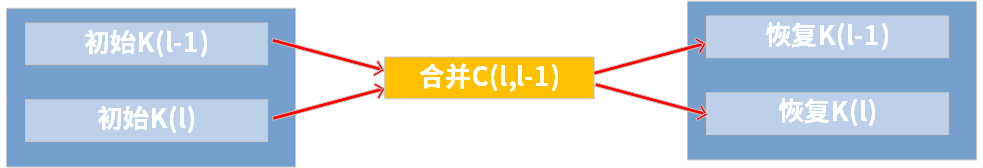

## KVcache压缩领域的研究

**量化：**QAQ,KIVI

**稀疏化：**

**层间压缩：**minicache(本文创新点)

## 提出背景

### 模型后半部分，KVcache层间相似度较大

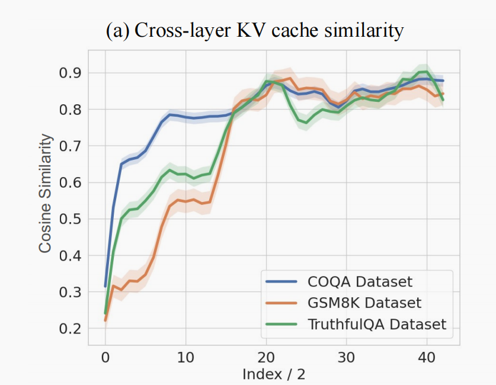

**横轴：**层对（每两层作为一对）

**纵轴：**层对中两层的余弦相似度

### 相似的两层，也存在离群token（余弦相似度较小）

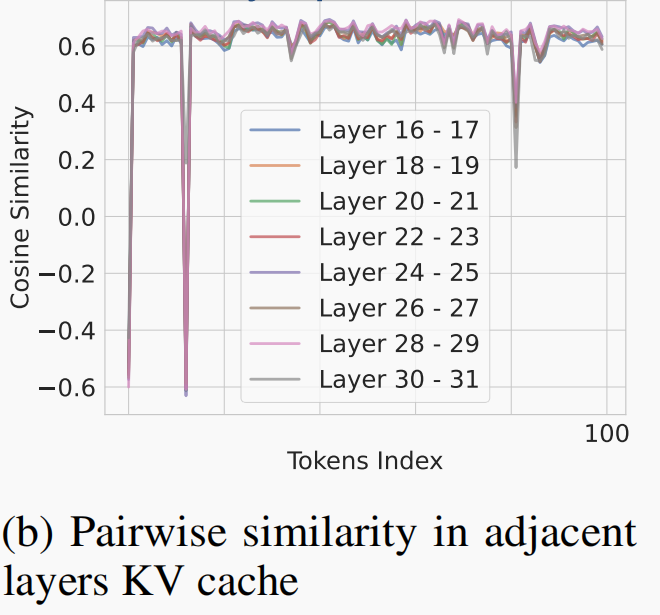

## MiniCache方法细节

### 只合并后L/2层

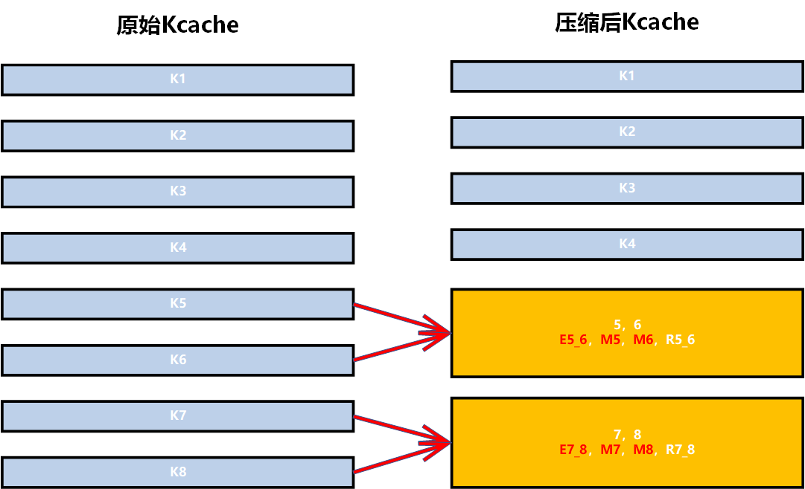

###  对于可合并的token进行合并

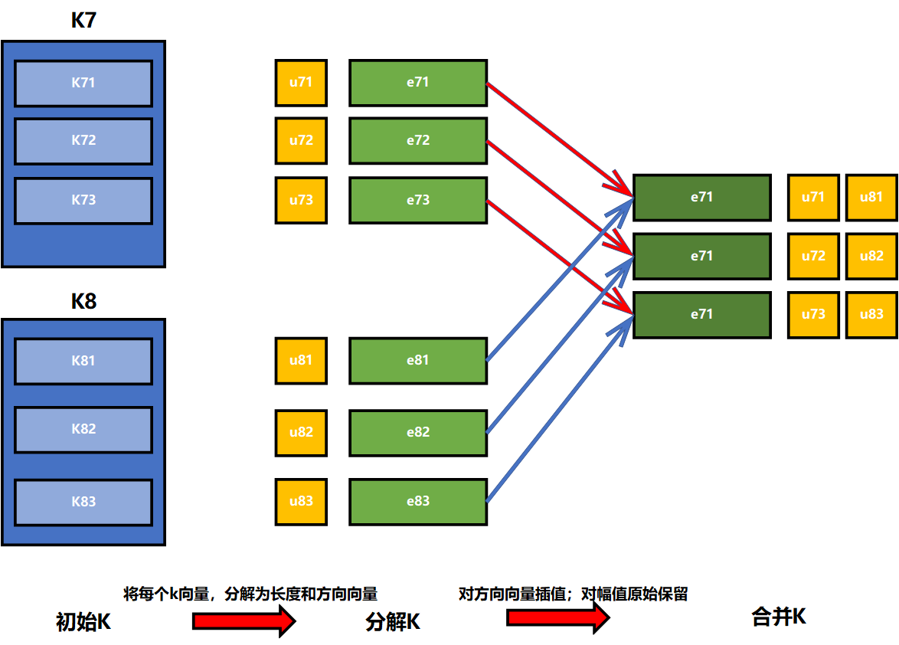

**把k向量分解为单位方向向量和幅值（长度）：**
$$
\Large
\begin{array}{lll}
k^{l-1}  &=& e^{l-1} \cdot \mu^{l-1} \\
k^{l} &=& e^{l} \cdot \mu^{l} \\
\end{array}
$$

**通过SLERP公式（球面线性插值）来对方向向量进行插值：**
$$
\large
\begin{array}{lll}
e^{l-1,l} = \dfrac{sin[(1-t)\Omega^{l-1,l}]}{sin(\Omega^{l-1,l})} \cdot e^{l-1} + \dfrac{sin[t\Omega^{l-1,l}]}{sin(\Omega^{l-1,l})} \cdot e^{l}
\end{array} \\ \\ \\

\large
\begin{array}{ll}
两个向量的夹角：& \Omega^{l-1,l} = arccos(e^{l-1} \cdot e^{l}) \\
插入后对e^{l}的偏向程度：& t \in [0,1]
\end{array}
$$

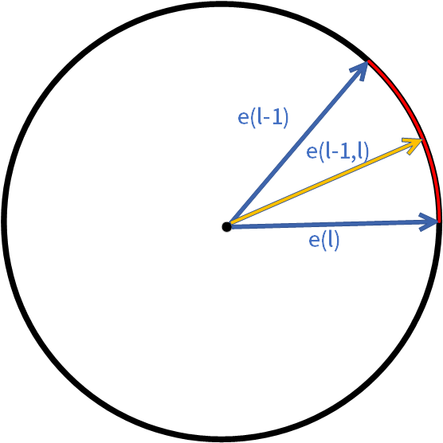

**保留原始幅值：**
$$
\Large
 \mu^{l-1},u^{l}
$$

### 对于不可合并的token，单独保存

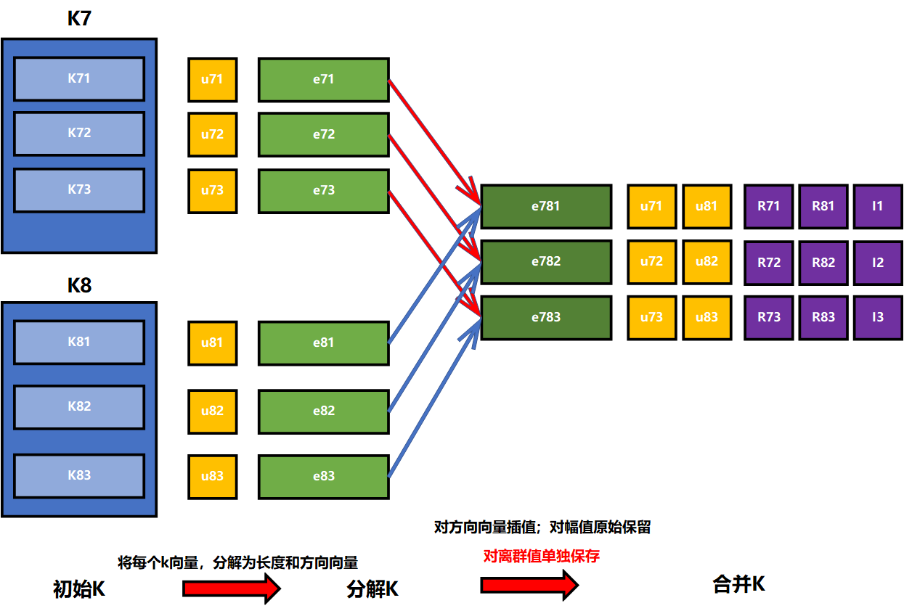

**判定不和合并token：**
$$
\Large
\begin{array}{llll}
	 I &=& \{i|d_{i} > d_{min} + (d_{max}-d_{min})\cdot \gamma \} \\
	 R &=& \{k_{i}|i \in I\}
	 
\end{array} \\ \\

\Large
\begin{array}{llll}
	两个token的k的角度距离，即不相似度： &d(k^{l},k^{l-1}) & = &  \dfrac{\Omega}{\pi} \\
	判定为不可合并的token的下标集合: & I
	
\end{array} \\ \\
$$

**单独保留**：
$$
\Large
\begin{array}{llll}
	 I,R
	 
\end{array} \\ \\
$$

## **实验结果**

**$\gamma$为0.05时理论压缩率：**
$$
\Large
\begin{array}{llll}
	 ratio = \dfrac{4h}{3.1h+2} \approx 1.33
	 
\end{array} \\ \\
$$

**4bit量化下的实验压缩率：**（这里其实有水分，因为把量化的压缩也算上了）

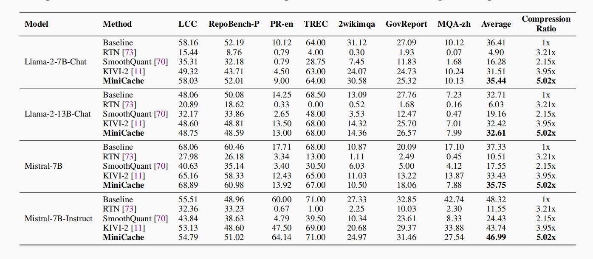

**性能：**压缩一半的层，性能基本每没下降

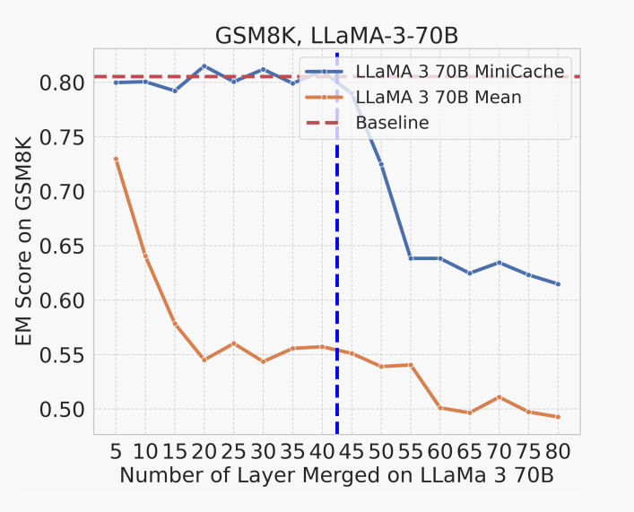

**大批次任务下的推理速度：**很快（内存读取速度是主要的性能瓶颈）

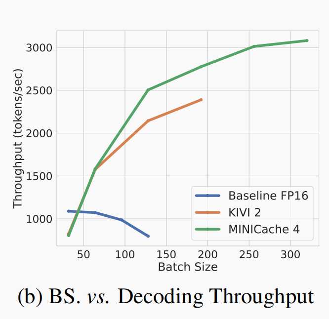

对于minicache，只需要加载一次压缩后的KV，就能进行两层的运算，减少HBM读取时间。

## 一些有趣的现象

### 超参数的选取

**t：合并l和l-1层时，对l层的倾向度：**

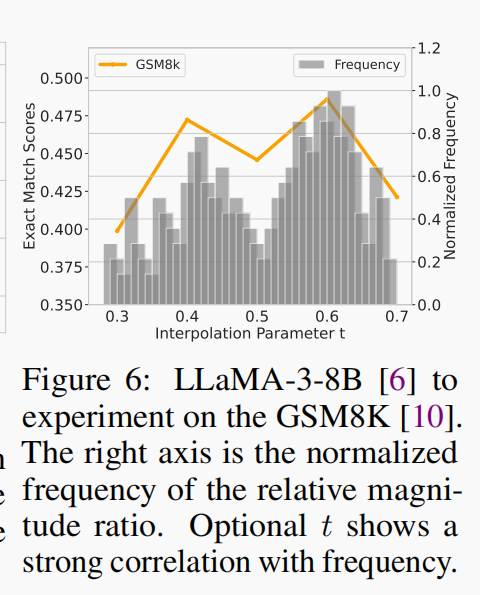

**Nomalized Frequency：**归一化后，不同相似度token的出现频率。（其实就是**归一化相似度后的概率密度曲线**）

**这里说明，可以根据概率密度曲线，找一个最佳的t**

**$\gamma$：越大表示保留的token越多：**

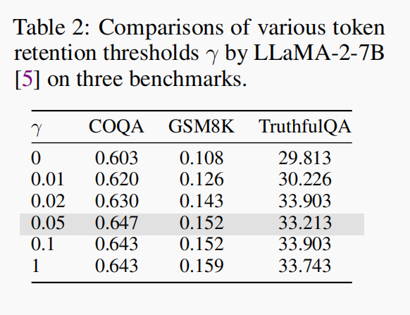

当$\gamma$大于0.05后，再增大已经对性能提升帮助不大了。说明不可合并token并不多，层间的差异并不大。

