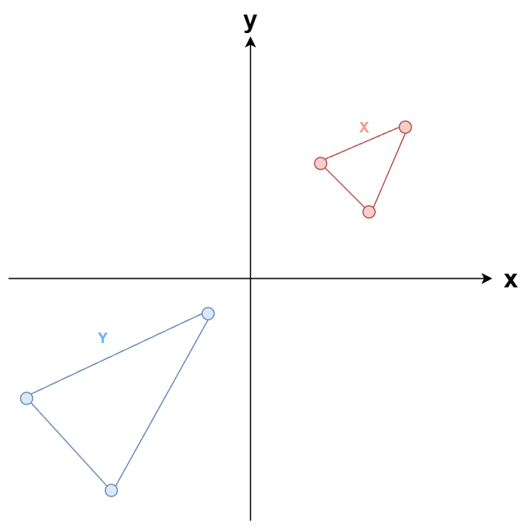
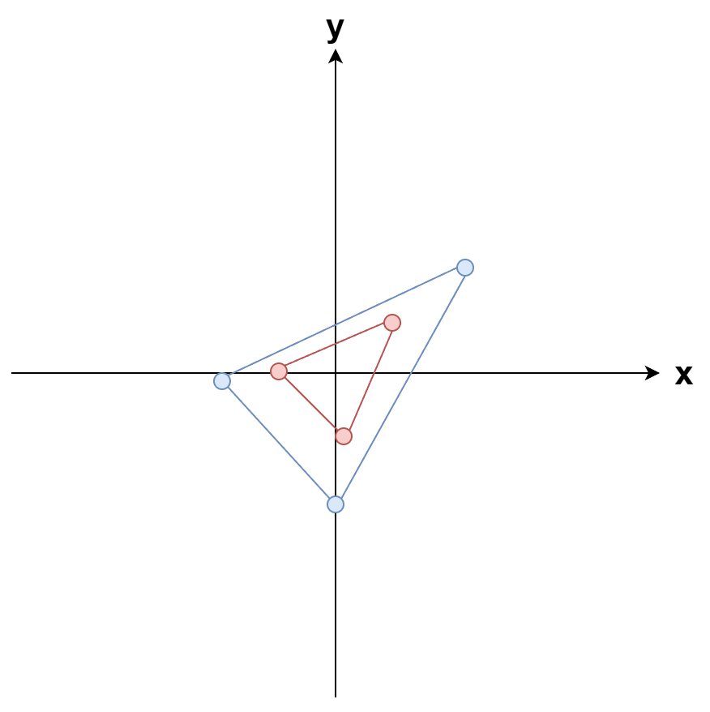
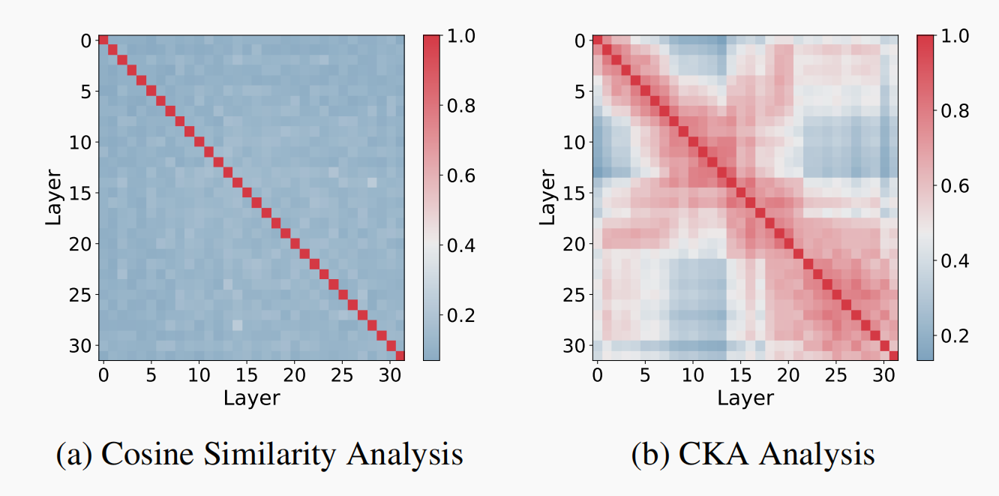
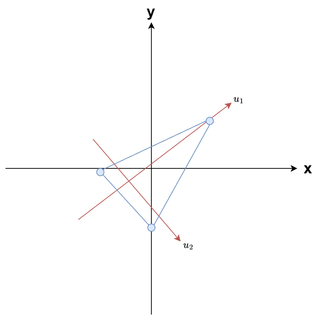
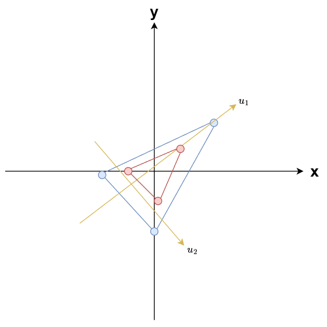
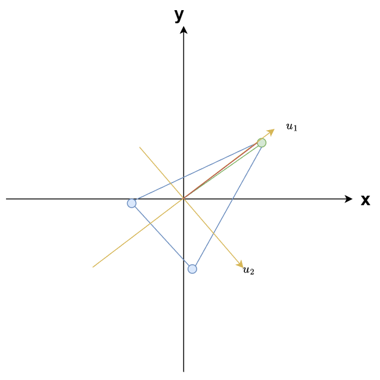

# xKV：通过奇异值向量实现的KVcache层间压缩

**论文：**XKV: CROSS-LAYER KV-CACHE COMPRESSION VIA ALIGNED SINGULAR VECTOR EXTRACTION

**作者：**[Chi-Chih Chang](https://openreview.net/profile?id=~Chi-Chih_Chang1), [Wei-Cheng Lin](https://openreview.net/profile?id=~Wei-Cheng_Lin2), [Chien-Yu Lin](https://openreview.net/profile?id=~Chien-Yu_Lin1), [Yash Akhauri](https://openreview.net/profile?id=~Yash_Akhauri1), [Hung-Yueh Chiang](https://openreview.net/profile?id=~Hung-Yueh_Chiang1), [Xilai Dai](https://openreview.net/profile?id=~Xilai_Dai1), [Huiqiang Jiang](https://openreview.net/profile?id=~Huiqiang_Jiang2), [Yucheng Li](https://openreview.net/profile?id=~Yucheng_Li5), [Kai-Chiang Wu](https://openreview.net/profile?id=~Kai-Chiang_Wu1), [Luis Ceze](https://openreview.net/profile?id=~Luis_Ceze1), [Mohamed S. Abdelfattah](https://openreview.net/profile?id=~Mohamed_S._Abdelfattah1)

**会议：**ICLR2026

## 简介

（1）借鉴MiniCache层间合并思想，并进一步改进

（2）摈弃余弦相似度，使用CKA来衡量层间相似性；改变层间合并方式

## 主要内容

### KVcache层间相似性判断

#### **宏观判断：CKA（Centered Kernel Alignment）**

##### CKA的象征解释

把矩阵X和Y中每个**向量**，看成**一个点**，其实就是研究这些点的**拓扑结构的相似性**

##### CKA的数学表示

**Step1：**待比较相似度的两个矩阵X和Y
$$
\large
X = \begin{bmatrix} 1 & 0 & 1 & 0 \\ 0 & 1 & 0 & 1 \\ 1 & 1 & 0 & 0 \end{bmatrix}, \quad Y = \begin{bmatrix} 3 & 1 & 3 & 1 \\ 1 & 3 & 1 & 3 \\ 3 & 3 & 1 & 1 \end{bmatrix}
$$

**Step2：**计算**Gram矩阵**，表示每个矩阵内部，获取**样本间的绝对相似度**
$$
\large
\begin{array}{ll}
K = XX^T，L = YY^T \\ \\ \\
K = \begin{bmatrix} 2 & 0 & 1 \\ 0 & 2 & 1 \\ 1 & 1 & 2 \end{bmatrix},
L = \begin{bmatrix} 20 & 12 & 16 \\ 12 & 20 & 16 \\ 16 & 16 & 20 \end{bmatrix} \\ \\
K_{ij}:X中，第i个样本和第j个样本的相似度（一行表示一个样本）
\end{array}
$$

**Step3：**分别归一化，从**绝对相似度**，转为**相对相似度**（每一行每一列平均值变为1）
$$
\large
\begin{array}{ll}
归一化矩阵：H = I - \frac{1}{3}\mathbf{11}^T \\ \\

\tilde{K} = HKH ， \tilde{L} = HLH \\ \\

\tilde{K} = \begin{bmatrix} 0.67 & -0.67 & 0 \\ -0.67 & 0.67 & 0 \\ 0 & 0 & 0 \end{bmatrix},\tilde{L} = \begin{bmatrix} 2.67 & -2.67 & 0 \\ -2.67 & 2.67 & 0 \\ 0 & 0 & 0 \end{bmatrix}

\end{array}
$$

- H矩阵归一化原理

$$
\large
\begin{array}{ll} 
HK = (I - \frac{1}{3}\mathbf{11}^T)K = K - K_{mean-column} \\
KH = K(I - \frac{1}{3}\mathbf{11}^T) = K - K_{mean-row} \\ \\
\frac{1}{3}\mathbf{11}^T = \frac{1}{3} \begin{bmatrix} 1 \\ 1 \\ 1 \end{bmatrix} \begin{bmatrix} 1 & 1 & 1 \end{bmatrix} = \begin{bmatrix} 1/3 & 1/3 & 1/3 \\ 1/3 & 1/3 & 1/3 \\ 1/3 & 1/3 & 1/3 \end{bmatrix} \\ \\

\frac{1}{3}\mathbf{11}^TK = \begin{bmatrix} 1/3 & 1/3 & 1/3 \\ 1/3 & 1/3 & 1/3 \\ 1/3 & 1/3 & 1/3 \end{bmatrix} \begin{bmatrix} 2 & 0 & 1 \\ 0 & 2 & 1 \\ 1 & 1 & 2 \end{bmatrix} = \begin{bmatrix} 1 & 1 & 4/3 \\ 1 & 1 & 4/3 \\ 1 & 1 & 4/3 \end{bmatrix}
\end{array}
$$

**Step4：**用HSIC衡量两个矩阵的相似度
$$
\large
\begin{array}{ll}
HSIC(K, L) = \frac{1}{(n-1)^2} \text{tr}(\tilde{K}\tilde{L}) \\ \\
\text{tr}(\tilde{K}\tilde{L}) = \sum_{i=1}^3 \sum_{j=1}^3 \tilde{K}_{ij} \tilde{L}_{ij} \\ \\

CKA(K, L) = \frac{HSIC(K, L)}{\sqrt{HSIC(K, K) \cdot HSIC(L, L)}} \\ \\

CKA(K, L) = \frac{7.12}{\sqrt{1.78 \times 28.48}} = \frac{7.12}{\sqrt{50.69}} = \frac{7.12}{7.12} = \mathbf{1.0}
\end{array}
$$

- HSIC除以$\frac{1}{(n-1)^2}$是为了归一化
- CKA，本质上就是将两个矩阵分别**拉长成一个向量**，然后**计算余弦相似度**

**总结：**从通过**余弦相似度**来判断层间相似性，转变为通过**矩阵内部样本的相对差异分布**来判断层间相似性

测试模型：Llama-3.1-8B-Instruct

### 奇异值分解

**任何一个矩阵都可以进行如下分解：**

- $U$:左奇异矩阵（每一列为一个左奇异向量）：一个方阵

- $$\Sigma$$:奇异值（每个奇异向量的权重）
- $$V^T:$$​右奇异值矩阵（每一列为一个右奇异向量）：v的维度是原来的特征维度（V是个旋转矩阵）
- 可以将A理解为一个空间变换
	- $V^T$：进行选择，将主要方向旋转到坐标轴上（$V$是个单位标准正交基）
	- $$\Sigma$$：每个坐标轴进行缩放（$\sigma$​越大表示该坐标轴上数值越大）
	- $U$:$u_i$表示不同token对$v_i$的贡献率（即投影强大）

$$
\large
\begin{array}{ll}
A = U\Sigma V^T \\ \\
A = \begin{bmatrix} 3 & 2 \\ 2 & 3 \end{bmatrix} =
\underbrace{\begin{bmatrix} 1/\sqrt{2} & 1/\sqrt{2} \\ 1/\sqrt{2} & -1/\sqrt{2} \end{bmatrix}}_{U} \underbrace{\begin{bmatrix} 5 & 0 \\ 0 & 1 \end{bmatrix}}_{\Sigma} \underbrace{\begin{bmatrix} 1/\sqrt{2} & 1/\sqrt{2} \\ 1/\sqrt{2} & -1/\sqrt{2} \end{bmatrix}}_{V^T}\\ \\
U = \{u_1,u_2\}, V = \{v_1,v_2\}
\end{array}
$$

### 从CKA到奇异值分解

CKA相似，表示U相似，每个token，对右奇异向量的投影强度相似

**xKV基于一个前提：**若CKA(A,B)很大，则它们的右奇异向量对齐。

因此，我们可以找一组公共的主奇异向量

### 层间合并

#### 投影

将A投影到主奇异向量基上
$$
\large
\begin{array}{ll}
A & = [3, 5] \\
V &= \begin{bmatrix} 0.6 & 0.8 \\ 0.8 & -0.6 \end{bmatrix} \\
V' &= \begin{bmatrix} 0.6 \\ 0.8  \end{bmatrix} \\
L &= A \times V'= [3, 5] \cdot \begin{bmatrix} 0.6 \\ 0.8 \end{bmatrix} = (3 \times 0.6) + (5 \times 0.8) = 1.8 + 4.0 = \mathbf{4.8}
\end{array}
$$

**恢复：**
$$
\large
\begin{array}{ll}
\hat{A} = L \times V^T \\
\hat{A} = 5.8 \times [0.6, 0.8] = \mathbf{[3.48, 4.64]}
\end{array}
$$

