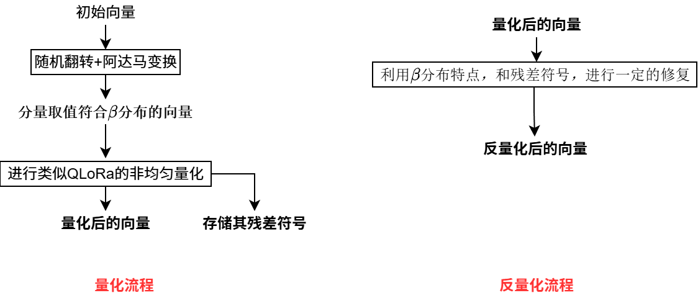

# TurboQuant学习笔记

针对量化的一种优化方案

SmoothQuant,AWQ通过通道级缩放来平滑数值，抑制离群值

TurboQuant，通过向量旋转来平滑数值，抑制离群值（尽量让每个分量的数值相等）

## 做法

**HD旋转**

- **随机翻转翻转**：让X的每个向量随机分布在不同的象限

$$
\large
\begin{array}{ll}
X' &= XD \\
D&：只含有1和-1的随机对角矩阵
\end{array}
$$

- **阿达马变换：**阿达马矩阵H是个所有元素都是1或者-1的正交矩阵（每两行，即每两个向量都是正交的）
- - **最后每个向量的每个分量，都是其实分量或其相反数的能量平均数（能量守恒）**
	- **相当于将没有向量分解到阿达马矩阵每个向量为基向量的空间中（除以根号d就是基向量模长为1，标准基）**
	- **我们的最终目的是将向量分解到某个单位标准正交基上，选择阿达马变换是为了考虑工程性能**
	- 阿达马变换工程实现速度快，随机翻转后阿达马变换恰巧又能够平滑数值

$$
\large
\begin{array}{ll}
X’' = X'DH\\
y_i = \frac{1}{\sqrt{d}} \sum_{j=1}^{d} (\pm 1) \cdot x_j
\end{array}
$$

**量化后极坐标存储：**

- **将4096维的向量分成128组，然后给每一组取一个模长因子**

$$
\large
\begin{array}{ll}
\alpha_g = \max(|v_{g,1}|, |v_{g,2}|, \dots, |v_{g,128}|)
\end{array}
$$

- **将每个分量除以相应的模长因子归一化**

$$
\large
\begin{array}{ll}
\tilde{v}_i = \frac{v_i}{\alpha}
\end{array}
$$

- **随机翻转和除以模长因子后，每个向量的分量取值概率符合$\beta$分布，然后进行类似于QLoRa的那种非均匀查表量化**

- **得到的$\beta$​分布是极值点在0，中间高两头小，在-1到1对称分布的。所以对于每一个量化区间都是绝对值更小的那部分概率更大，导致最终量化反量化后得到的向量模长偏小的概率更大。最终计算注意分数时，点积就会偏小，softmax对点积大小很敏感，最终对重要token的注意力就会偏小很多**
- **QJL：存K的残差符号，计算时获取Q的残差符号**

$$
\large
\begin{array}{ll}
r_K = K_{original} - \text{Dequantized}(\hat{K}_{quantized}) \\
\end{array}
$$

$$
\large
\begin{array}{ll}
\text{Correction} = \beta \cdot (2 \cdot \text{Popcount} - \text{Dimension}) \\
PopCount:r_k和r_v符号相同的个数 \\
Dimension: 子向量的维度
\end{array}
$$

## 补充概念

### PQ：Product Quant

一种利用K-means聚类来实现量化的算法

针对存储+检索两大需求来设计
