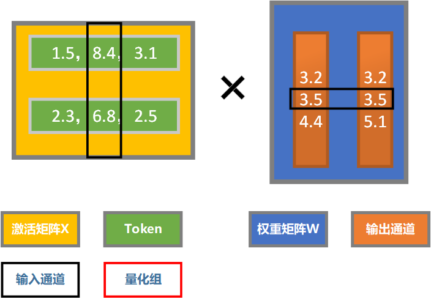
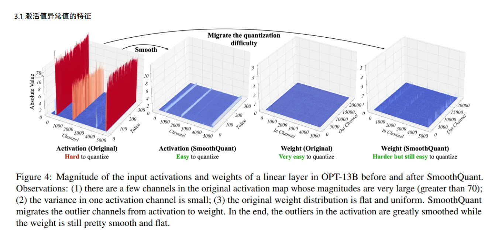
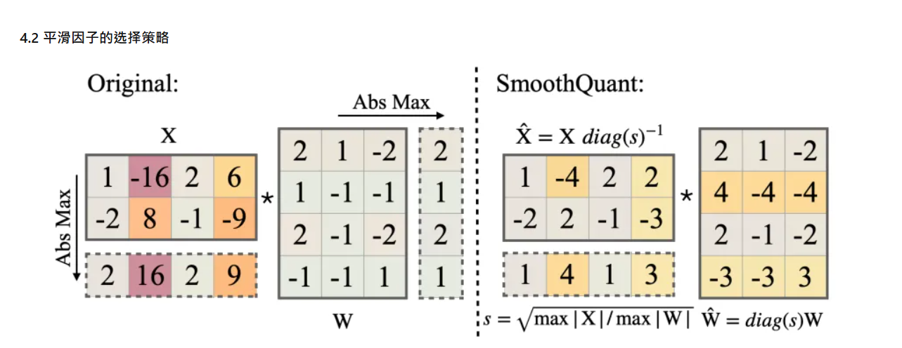
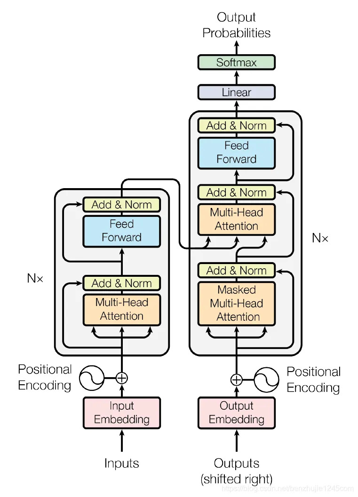
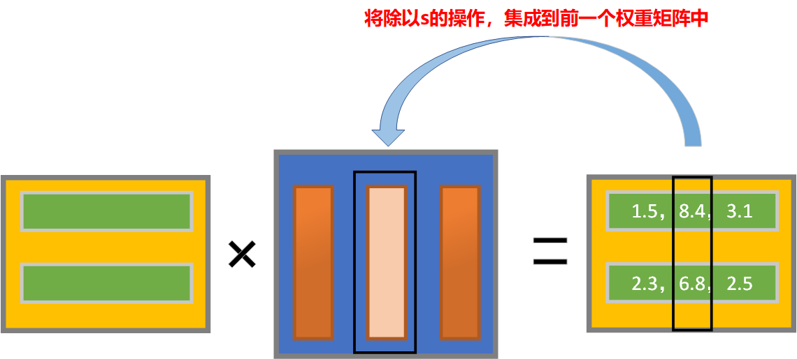

# AWQ_SmoothQuant 集成

## 各种量化方案

### 仅量化权重值（W4A16）

**主存中存储量化后的权重值，需要时将其加载到SM进行反量化，然后原精度进行矩阵运算**

（1）将量化后的权重值，和原精度的激活值，从全局主存读取到SM。

（2）将权重值反量化。

（3）进行原精度的矩阵乘法和激活值运算。

（4）最后将原精度的结果传回全局主存

**节省了全局主存的空间占用，减少了内容访问带宽**

### 同时量化激活值和权重值（W8A8,W4A8）

（1）将量化后的权重值，和量化后的激活值从全局主存读取到SM。

（2）然后直接用量化值参与线性运算。

（3）然后再将结果反量化，参与激活函数运算。

（4）然后将最终得到的激活值量化后传回主存。

**相比仅量化权重值，使用量化值进行矩阵乘法，运算更快**

## AWQ和SmoothQuant复习

SmoothQuant和AWQ都是对输入通道进行缩放

**SmoothQuant：**

- **尽量减小激活值，不同输入通道之间的方差，平滑激活值，降低激活值的量化难度**

- **输入通道i的平滑因子**$diag(s_i) = \sqrt{\dfrac{max_k(|X_{ki}|)}{max_p(|W_{ip}|)}}$

- **运算转换**：$x*w = x*diag(s)^{-1}*diag(s)*w = x\prime * w\prime$

**AWQ**:

$$ s_{xi} = mean_j(|X_{ij}|) $$
$$s_i = s_{xi}^\alpha $$

$$\alpha \in [0,1] $$

## 联合因子寻找

**SmoothQuant和AWQ的本质都是对某个输入通道的激活值和权重值进行缩放**

$s = s_{sm} * s_{AWQ}$​

### OmniQuant介绍

**OmniQuant是一种通过学习来寻找最优量化参数的方法，它主要由两部分组成LWC，LET：**

**LWC：**学习对权重值的裁剪（这里不细讲，这部分我们这里用不到）

**LET（Learnable Equivalent Transformation）：**通过梯度下降的方法来学习输入通道的缩放参数

$$
\large
\begin{array}{l}
量化公式：Q(Z) = \text{round}(\frac{\text{clamp}(Z)}{\Delta}) \cdot \Delta \\
损失函数：\mathcal{L}_{mse} = \| \text{Block}_{full}(X) - \text{Block}_{quant}(\hat{X}, \hat{W}) \|^2 \\
\end{array}
$$
**把round函数的梯度设为1，就可以梯度下降学习s了**

### 对激活值进行缩放的工程实现

 为了减少运算量，对激活值的缩放一般都是集成到前一个运算中的

#### 前一个运算为线性运算

#### 前一个运算为ReLU激活值函数

因为ReLU函数具有正齐次性，缩放因子又是正数，所以可以直接集成

$\text{ReLU}(x) =  \begin{cases}  x & \text{if } x \geq 0, \\ 0 & \text{otherwise}. \end{cases}$

**ReLU函数具备正齐次性**： $\text{ReLU}(kx) = k*\text{Relu(x)}, k>=0$

**又因为量化步长scale是不小于0的：**$ \text{ReLU}(\dfrac{X_{pre}W}{s_x s_w})s_x s_w = \text{ReLU}(X_{pre} W)$

#### 前一个运算为Norm（层归一化）

qwen、LLama等几乎所有的主流大模型使用的都是RMSNorm
$$
\large
\begin{array}{l}
均方根：\text{RMS}(\mathbf{x}) = \sqrt{\frac{1}{d} \sum_{i=1}^{d} x_i^2 + \epsilon} \\
归一化：\bar{x}_i = \frac{x_i}{\text{RMS}(\mathbf{x})} \\
重缩放：y_i = \bar{x}_i \times \gamma_i \\
\end{array}
$$
**我们可以把缩放因子集成到$\gamma$中**：
$$
重缩放：y_i = \bar{x}_i \times \dfrac{\gamma_i}{s} \\
$$

### 在联合因子的寻找中，加入层间相似性的考量

$$L_{total} = L_{mse}(\text{本层误差}) + \lambda \cdot L_{sim}(\text{第 } l \text{ 层与第 } l-1 \text{ 层的相似性})$$

我们可以考虑在损失函数中增加，经过缩放后的，层间激活值（KVcache）的相似性损失。

如果可以实现“量化的同时，保持KVcache的层间相似性”，就可以集成很多基于层间相似性的KVcache优化算法，比如KIVI，MiniCache

