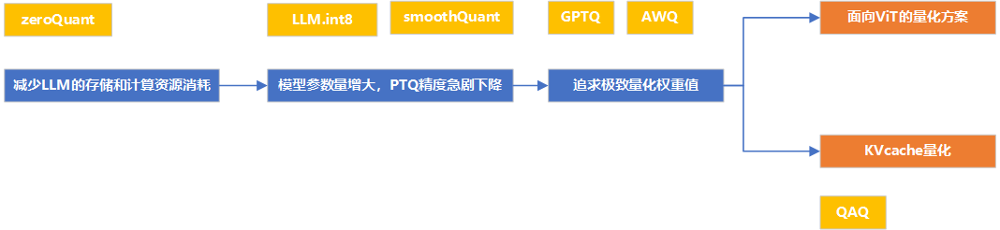

# LLM量化技术发展脉络

**我们以所面向的问题作为逻辑，来组织一下大模型量化技术的发展脉络。**

我们以每个阶段所面向的主要问题，和代表性的杰出成果作为该阶段的代表

## 节省存储和计算资源

**量化历史非常悠久，在LLM之前就已经提出对神经网络使用量化**

**最简单的量化：W8A8**

- **对称量化**
- **非对称量化**

## 解决激活值中离群值，造成较大量化误差的问题

- **zeroQuant：**分组量化权重值；动态量化激活值；量化感知训练让激活值更集中

- **smoothQuant：**平滑激活矩阵，将其量化难度转移到权重矩阵（主流）

- **LLM.int8：**对离群值通道，和非离群值通道分开计算（追求高精度场景）

	

## 追求极致地量化权重矩阵（降低权重矩阵的量化误差）

- **GPTQ：**将模型的权重以每一层，和每一层中每一块来划分成多份。然后依次量化。先量化的权重会影响后量化权重的量化值。

​	后量化权重会在先量化权重的基础上选取最小化量化误差的值（本质上就是一种贪心算法）

- **AWQ：**可以粗略理解为smoothQuant和GPTQ思想的结合。

	AWQ的思想是，尽可能地保护重要的权重值。
	过程是：通过统计激活值，找到重要的权重通道；找到最优的缩放因子；逐块量化但逐层优化；将缩放因子对激活值的运算结合到前一层的权重矩阵中去。

- **Q-LoRa**

- **spQR**

- **OminiQuant**

## KVcache的量化

**QAQ**

## 面向兴起的ViT中的量化优化问题

